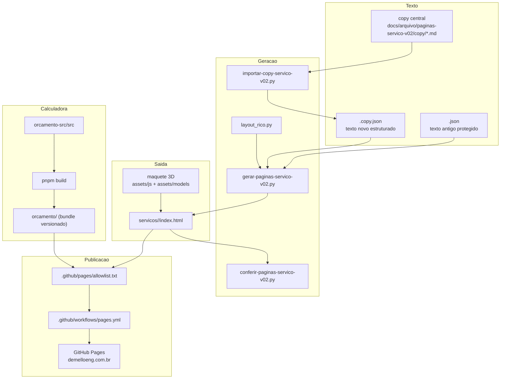

# Mapa do código: site da DEMELLO Engenharia

> **Atualização de 17/11/2026 — Home V02: vitrine das maquetes e clientes.** `index.html` (à mão) ganha, no hero, o link secundário "Explorar nossas maquetes 3D" para `#projetos-e-servicos`, fora de `.actions` (os dois CTAs comerciais seguem os únicos ali; `site_ux.test.mjs` confere). A vitrine passa a cinco `.service-row` com as capas `assets/images/maquete-*-capa.webp` e os mesmos `?v` das páginas de serviço (Arquitetura, Estrutural, Hidrossanitário, Incêndio, Terraplanagem); a Home não carrega motor 3D nem GLB (teste). `home-opcao3-hero/hidro/incendio.webp` deixam de ser usadas na vitrine (a primeira continua no hero). Clientes: novo `assets/images/EDUCA_PARANA_logo.png` (na allowlist; a fonte `LOGOS_CLIENTES/EDUCA_PARANA_logo_fraca_nao_usar.png` não é usada), os quatro logotipos coloridos e `alt=""`, porque o nome está escrito abaixo. O CSS novo fica no fim de `home-opcao3-20261027.css` (`?v=3`) e sobrepõe duas regras de `v02-proposta.css` que valiam para o conteúdo antigo: `.service-row:first-child img` (enquadramento da ilustração) e `.clients li:first-child` (Consórcio só em texto).

> **Atualização de 17/11/2026 — maquete V03 da arquitetura.** A página `projeto-arquitetura` troca o visualizador `assets/js/maquete-3d.js` e o markup `maquete-markup.html` (os dois ficam no site, sem uso, para reversão) pelo motor comum (seção 4.1), com a configuração e a extensão `assets/js/maquetes/arquitetura.mjs` e as funções puras de `assets/js/maquetes/casa.mjs` (`pecas`, `juntarVizinhas`, `separarPlanas`, `medida`, `degrausDoSolo`). O GLB `casa-exemplo.glb` fica intacto (SHA `b6f3dba…`); é o mesmo que a hidrossanitária usa como casca. Ele vem por classe (10 malhas), sem normais, sem nomes de ambiente, sem pavimentos e sem norte. Na carga, a extensão divide cada camada em peças contíguas, com ficha por peça (Parede com altura; Porta e Janela com a medida da peça). As portas juntam guarnições e folha com folga de 25 cm (14 portas). Tira o painel de espessura zero das janelas para a camada translúcida "vidros" (11 caixilhos e 11 vidros), cujo botão acompanha o de Janelas. Monta o solo em degraus pela base dos muros (o comportamento da `maquete-3d.js` publicada), com furo da piscina e tampa de stencil no Corte. Há dois estilos: Projeto técnico (contorno forte) e Realista (cores de material por aproximação, palco claro, contorno suave por uniforme). A Planta é cortada a 1,50 m do piso térreo, com tampa escura por stencil; o clique ignora o que foi recortado (`respeitaPlanos`). `giroCena` vale −90, e o Corte do motor passa ao longo do lote (piscina, deck, casa). A Fachada é a vista `frente` do motor, com o rótulo "Fachada". Níveis: Piscina 1,51, Térreo 3,68, Laje superior 6,68 e Cobertura 7,35 (faces horizontais do GLB, os mesmos nomes da hidro). O motor ganha recursos opcionais (seção 4.1); ausentes, as outras quatro maquetes não mudam. Só o markup, o CSS e o script da página mudam; os blocos de copy continuam e o gerador usa o ramo `elif arq_pg`. Modelo novo `assets/models/casa-exemplo-v03.json`, CSS `maquete-arquitetura-v03.css` e capa `assets/images/maquete-arquitetura-capa.webp` (770×481, cerca de 10 KB); cinco caminhos novos na allowlist (seção 9).

> **Atualização de 17/11/2026 — maquete V03 da terraplanagem.** A página de Infraestrutura (`projeto-terraplenagem`) troca o visualizador `assets/js/maquete-terraplanagem-3d.js` (V5; ele, o JSON antigo e o markup `maquete-terraplanagem-markup.html` ficam no repositório, sem uso, para reversão) pelo motor comum (seção 4.1), com a configuração e a extensão `assets/js/maquetes/terraplanagem.mjs` e as funções puras de `assets/js/maquetes/terreno.mjs` (`blocoTerreno`, `curvasDeNivel`, `linhaDe`, `fatorLinha`, `corTerreno`, `secao`, `linear`). O GLB `terraplanagem-djalma.glb` fica intacto (SHA `b1ac311…`). As malhas `TERRENO_NATURAL` e `TERRENO_FINAL` têm a mesma planta (x, z e índices) e diferem só na cota (−2,50 a +2,85 m). A extensão troca a malha natural por um bloco fechado (topo, paredes e fundo), para a tampa do corte (stencil) funcionar, e reescreve as cotas no próprio buffer de posição (não é morph target) conforme a linha que desce. `TERRENO_FINAL` e `MARCA_*` saem da cena; as cores por vértice do GLB passam de sRGB a linear na carga. Nesta página a vista "corte" se chama "Seção"; os prismas de corte e aterro não levam tampa (`semTampa`). A caixa fechada monta em 4,2 s; a primeira abertura conta a sequência em 11 s. **Nenhum número de volume é mostrado** (aterro 744 m³ medido contra 401 m³ do memorial: não resolvido). O motor ganha ganchos opcionais (seção 4.1); ausentes, as outras três maquetes não mudam. Modelo novo `terraplanagem-djalma-v03.json`, CSS `maquete-terraplanagem-v03.css`, capa `maquete-terraplanagem-capa.webp` (770×480, cerca de 6,5 KB) e markup `maquete-terraplanagem-v03-markup.html`; o gerador usa o markup novo, o `?v=1` do módulo e os dois CSS da V03. Allowlist com 5 caminhos novos (seção 9). Testes novos em `maquetes_v03.test.mjs`, `maquete.spec.mjs` e `maquete-sem-webgl.spec.mjs`.

> **Atualização de 17/11/2026 — maquete V03 de incêndio (hidrantes do Colégio Luiz Carlos).** A página troca a ativação V02 (`hidrantes-luiz-carlos-ativar.js`, pôster e clique; os arquivos da V02 ficam no site para reversão) pelo motor comum (seção 4.1) com a configuração `incendio.mjs` e a casca do colégio `hidrantes-luiz-carlos-casca.glb`, gerada por `scripts/gerar-casca-luiz-carlos.py` a partir da planta 1:75 do projeto hidrossanitário (fora do repositório; método e limites em `docs/CASCA_LUIZ_CARLOS.md`). GLB e JSON de hidrantes inalterados. O motor ganha recursos ligados só pela configuração (guias, lista de componentes, marcadores, ficha completa, `nivelChao`, níveis por cota fixa); com ficha completa e peça escolhida não desenha o quadro de oclusão. CSS próprio `maquete-incendio-v03.css` (seção 5.1); allowlist com 4 caminhos novos (seção 9). O gerador de páginas usa `maquete-incendio-v03-markup.html`. Entra em `PAGINAS_V03`.

> **Atualização de 16/11/2026 — maquete V03 da hidrossanitária.** A página troca `maquete-hidro-3d.js` (que fica no repositório, para reversão) pelo motor comum (seção 4.1) com a configuração `hidro.mjs`: casca arquitetônica transparente (decisão 160), redes com as cores do IFC (sem a entrada genérica "Tubo" na legenda), corte, níveis tirados dos pisos da casca e capa WebP. Modelos `hidro-casa` e `casa-exemplo` inalterados. Entra em `PAGINAS_V03` no teste.

> **Atualização de 16/11/2026 — maquete V03 da estrutural.** A página troca o visualizador `maquete-estrutura-3d.js` (que fica no repositório, para reversão) por um **motor comum** em `assets/js/maquetes/` (seção 4.1), preparado para receber a hidrossanitária na entrega seguinte. Na mesma entrega: `?v` de cada modelo = início do SHA-256 **do próprio arquivo** (antes o `.json` levava o hash do `.glb`); capa WebP por baixo do palco; camada "Fundações" (sem afirmar o tipo); e o cartão do mezanino na abertura, na coluna da maquete, acima da caixa (`hero(..., acima_caixa=)` em `layout_rico.py`; chamada vinda da copy `COPY_ESTRUTURAL_V07_20261116.md`, linha "Chamada:" reconhecida pelo importador; decisões de Marcos de 16/11, que alteram o "discreto" da decisão 83). Com a maquete aberta em tela cheia o motor põe `body.mq3-aberta`, que esconde o botão do WhatsApp.

> **Atualização de 16/11/2026 — botão flutuante do WhatsApp (`assets/js/contato-flutuante.js`).** Símbolo e texto passam a branco com uma regra de duas classes (`.dm-fab .dm-fab__link`): as páginas V02 pintavam o símbolo de azul sobre o verde (armadilha 19). Na mesma regra de estilo, `body.mq3-aberta .dm-fab{display:none}` esconde o botão quando uma maquete V03 está aberta em tela cheia; a classe só é posta pelo motor das maquetes V03 (entrega seguinte) e não existe nas maquetes atuais nem na calculadora. Eventos de contato e medição não mudam. Teste de cascata em `p04_transversais.test.mjs`.

> **Atualização de 07/11/2026 — calculadora e componentes transversais (P01 a P05; branch `feat/calculadora-modernizacao-integrada`, sobre a `main` `7db1765`).** Módulos novos em `orcamento-src/src`: `nav_history.mjs` (histórico do navegador), `municipios.mjs` e `pickers.jsx` (município do IBGE vinculado à UF e contato), `phone.mjs` (telefone brasileiro e e-mail). O catálogo `orcamento-src/public/assets/municipios-ibge.v1.json` (5.571 municípios) é gerado por `scripts/gerar-municipios-ibge.py` e sai em `orcamento/assets/`; a visita não chama a API do IBGE. Rótulo exibido × valor gravado: `DISPLAY_LABELS` em `journey.mjs` ("Orçamento e cronograma", "Terraplanagem" e "Projeto Elétrico" na tela; os valores e os códigos `ORCAMENTO`, `TERRAPLENAGEM` e `ELETRICA` não mudam). Projeto Elétrico é opção só da calculadora: preço automático só na tipologia residencial (CASA), a R$ 6,88/m² com o fator 0,80 aplicado uma única vez (base implícita de R$ 8,60/m² na tabela, com procedência `DERIVADA_DE_DECISAO_COMERCIAL_DOCUMENTADA`, que NÃO é transcrição de publicação AltoQi); as demais tipologias vão para avaliação humana. A tabela ganhou `automatic_estimate_limits` (10.000 m² nas bases de edificação, 100.000 m² no terreno, 200 h por serviço): acima disso o serviço sai do automático, a informação é preservada e o contato continua liberado. O resultado tem autoridade única: `journey.resultFor` (X3A só com `pricing_preview.status` CALCULATED, registrado por `payload_v2.mjs`). Painel da maquete e da estimativa no "Seu caso": `live_plan.mjs` (modelo, só lê o motor), `maquete_model.mjs` (cena e isométrico, sem DOM), `maquete3d.mjs` (cena Three, chunk sob demanda; o Three é o hospedado em `assets/vendor/three/`, sem dependência npm) e `LivePlan.jsx`. O WhatsApp na calculadora fica acoplado ao rodapé (computador) ou ao painel fixo (celular), não flutua. Componentes transversais: `assets/js/contato-flutuante.js` (WhatsApp flutuante, posição de medição `floating`) e a badge oficial do Simple Analytics no rodapé (imagem local inalterada em `assets/images/simple-analytics-badge.svg`); os dois nascem nos geradores e na Vite, não em edição manual de página. O ouvinte de cliques de contato (`contact-clicks.mjs`) passou a ser único por documento e também roda na calculadora. Testes: 30 arquivos Node e 478 casos (novos: `p01_confiabilidade`, `p02_municipios_contato`, `p03_eletrico`, `p04_transversais`, `p05_planta_orcamento`; `tests/support/catalogo.mjs` carrega o catálogo do IBGE nos testes de localização). O bundle foi recompilado (`index-FTNqd-68.js`, `index-BKV1UQ1J.css`, chunk `maquete3d-xigJy2xu.js`) e `build_artifact.py` acompanha. Tabela DEMELLO V2, revisão R2 (08/11/2026, Opção A): `orcamento-src/src/pricing/pricing-table.v2.json` e `engine.mjs` passam a comparar TODAS as referências documentadas (SECID/PR 094/2026, FUNDEPAR 001/2025 por categoria de origem, AltoQi) e cobrar 0,80 x a menor; o preview sai como `STRUCT_COMPOSITE_REFS_R2` (o R1 só é reproduzido pelo motor Python canônico, tabela congelada `pricing-table.v2.r1.json`); `references.mjs` mostra uma entrada FUNDEPAR (a de menor total). Espelho do canônico; Worker `ma-demello-preview` vendoriza o mesmo motor. Hotfix de 08/11/2026: na tela inicial do celular (até 900 px) o botão do WhatsApp deixa de ser absoluto e entra no fluxo do painel (regra `.is-entry .case-panel .dm-fab--docked` no fim de `styles.css`), para não cobrir o rótulo "Calcular estimativa"; o JS compilado só muda de nome. Protótipo e evidências do P05, fora da allowlist (não publicados): `docs/prototipos/calculadora-v03/` (capturas em `evidencias-p05/`); versão 3D, exploração das três composições e evidências em `docs/prototipos/calculadora-v04/`. O Cartographer não foi executado; esta é uma nota dirigida.

> **Candidata local — Experiência Técnica V02, issue #21, 06/11/2026.** Copy V01 consolidada integral em `docs/arquivo/experiencia-tecnica-v02-20261106/`, extraída literalmente da entrega aprovada no chat. `scripts/gerar-experiencia-v02.py` fixa seu SHA-256 e gera somente `experiencia-tecnica/index.html`; `--check` compara bytes sem escrever. Sete blocos, quatro destaques equivalentes em grid 2 × 2, sete fichas complementares e detalhes nativos. Header/footer V02 reutilizados do precedente institucional; componentes globais não alterados. CSS `experiencia-v02.css`; uma instância do visualizador publicado de hidrantes, ativada pelo adaptador local `experiencia-bim.js`. Three.js e GLB somente após interação. Djalma usa prévia capturada da demonstração existente e link para sua página; nenhum IFC do Interventor incluído. Contratos em `scripts/test_experiencia.py`, testes Node reconciliados e etapa específica no workflow. Assets novos na allowlist. Inventário candidato: 16 páginas V02 e 5 antigas. Esta nota descreve implementação local; integração/publicação dependem de autorização.


> **Candidata local de 06/11/2026 — Metodologia V02, issue #20.** Base `7c144a85fc882a5015030aef01d4c5ca585a5fb6`, branch exclusivamente local `feat/metodologia-v02`, sem commit ou publicação nesta etapa. `metodologia/index.html` passa a ser gerado por `scripts/gerar-metodologia-v02.py`, a partir de `docs/arquivo/metodologia-v02-20261106/COPY_METODOLOGIA_V01_20261106.md`, Copy V01 aprovada no comando de implementação, com os dois ajustes finais incorporados. O SHA-256 da fonte é fixado pelo gerador e incluído no HTML. São seis blocos, cinco momentos em lista ordenada e responsabilidade técnica em bloco transversal. Menu e rodapé reutilizam apenas constantes do gerador de Construir ou ampliar, sem executar sua CLI; `aria-current` fica em Como trabalhamos. CSS isolado `assets/css/metodologia-v02.css`, incluído na allowlist; contratos em `scripts/test_metodologia.py` e passo correspondente no workflow. `--check` compara bytes LF e não escreve. URL, canonical, og:url, BreadcrumbList, CTA para `/orcamento/`, WhatsApp, analytics e calculadora preservados; sem Service, evento ou parâmetro novo. Os testes Node `commercial_site` e `hotfix` reconciliam os cinco momentos, os links e a inclusão no conjunto V02. Inventário **da candidata local**: 21 páginas editoriais, 15 V02 e 6 antigas; a base publicada permanece 14 V02 e 7 antigas. A candidata não foi aberta em navegador, não tem capturas nem aceite visual. Cartographer não foi executado; esta nota é uma atualização dirigida. As contagens e classificações históricas abaixo continuam datadas e são subordinadas a esta nota apenas quanto à candidata.

> **Atualização de 06/11/2026 — Avaliar um problema V02, issue #19 (base `5487621`).** Candidata em branch, sem publicação: `avaliar-um-problema/index.html` passa a ser gerado por `scripts/gerar-avaliar-um-problema-v02.py`, com `--check`, a partir de `docs/arquivo/avaliar-um-problema-v02-20261106/COPY_AVALIAR_UM_PROBLEMA_V02_20261106.md`. Sete blocos: hero, segurança, situações, percurso do formulário, atendimento técnico, FAQ e CTA final. O gerador importa somente as constantes MENU, RODAPE e BreadcrumbList do precedente Construir ou ampliar (via `runpy`, sem executar sua CLI), retira o `aria-current` de Construir e preserva o BreadcrumbList próprio. CSS isolado `assets/css/avaliar-um-problema-v02.css`, incluído na allowlist. `scripts/test_avaliar.py` protege campos, fidelidade, determinismo, segurança literal e o modo `--check` sem escrita; executado no CI. A copy aprovada mantém a orientação de emergência uma vez, sem duplicação na FAQ; os testes conservam os telefones e a pendência humana, além da retenção da jornada. URL, canonical, `og:url`, os dois CTAs `?situacao=problem`, WhatsApp, medição e calculadora não mudam. Não há schema Service nem maquete. Inventário da candidata: 21 páginas HTML, **14 V02 e 7 antigas**; artefato esperado: **145 arquivos**. Onde o corpo abaixo classificar Avaliar um problema como antiga/à mão, prevalece esta nota. Cartographer não foi executado nesta atualização dirigida.

> **Documento canônico do site (decisão de Marcos, 30/10/2026).** Fica no repositório, versionado junto com o código. **Toda mudança estrutural no site muda este mapa na mesma entrega:** página nova, serviço renomeado ou agrupado, script novo, teste novo, arquivo na allowlist, mudança de menu, de rodapé ou de publicação. A skill `gerar-pagina-servico` inclui esse passo. Para atualizar, rodar o Cartographer em modo de atualização (ele reaproveita o que não mudou).

> **Atualização de 06/11/2026 (frente Compatibilização BIM V02, issue #15, branch `claude/compatibilizacao-bim-v02` sobre a `main` `cc21ef2`).** `/servicos/compatibilizacao-bim/` passou do layout antigo, à mão, para o layout rico gerado, com o perfil novo `compatibilizacao` (copy `COPY_COMPATIBILIZACAO_BIM_V02_20261106.md`; módulos `copy_compatibilizacao.py` e `layout_compatibilizacao.py`, CSS `servico-compatibilizacao-v02.css`, teste `test_compatibilizacao.py`, passo próprio no `pages.yml`). Nove seções, sem grupo recolhível: os detalhes do escopo ficam visíveis. URL, canonical, `og:url`, o JSON-LD (Service "Compatibilização BIM" e BreadcrumbList; só a descrição acompanha a copy) e o identificador da calculadora (`servico=compatibilizacao`) não mudam. Links contextuais para `/metodologia/` e `/servicos/orcamento-tecnico/`. Inventário: 21 páginas HTML, **13 no V02 e 8 antigas**. O catálogo não mudou (o cartão integrado é etapa própria). Artefato esperado: 144 arquivos. Onde as seções abaixo falarem de 12 páginas V02 ou de Compatibilização BIM como página antiga, vale esta nota. O mapa não foi regerado pelo Cartographer.
>
> **Atualização de 05/11/2026 (frente Orçamento e cronograma V02, issue #15, branch `feat/orcamento-cronograma-v02-revisao-local` sobre a `main` `99083c2`).** `/servicos/orcamento-tecnico/` passou do layout antigo, à mão, para o layout rico gerado, com o perfil novo `orcamento` (copy `COPY_ORCAMENTO_CRONOGRAMA_V02_20261105.md`, que substitui a V01 só na prova técnica, para a metragem aparecer uma vez; módulos `copy_orcamento.py` e `layout_orcamento.py`, CSS `servico-orcamento-v02.css`, teste `test_orcamento.py`). URL, canonical, `og:url` e o identificador da calculadora (`servico=orcamento-tecnico`) não mudam; o Service do JSON-LD passa a se chamar "Orçamento e cronograma" (decisão 75). Inventário: 21 páginas HTML, **12 no V02 e 9 antigas**. Compatibilização BIM segue no layout antigo e o catálogo não mudou (o cartão integrado fica para quando as duas páginas estiverem prontas). Artefato esperado: 143 arquivos. Onde as seções abaixo falarem de 11 páginas V02 ou de Orçamento como página antiga, vale esta nota. O mapa não foi regerado pelo Cartographer.
>
> **Atualização de 05/11/2026 (frente Regularização V02, issue #16, branch `claude/regularizacao-v02` sobre a `main` `dcd385f`).** `/servicos/regularizacao/` passou do layout antigo, à mão, para o layout rico gerado, com o perfil novo `regularizacao` (copy `COPY_REGULARIZACAO_V02_20261105.md`, módulos `copy_regularizacao.py` e `layout_regularizacao.py`, CSS `servico-regularizacao-v02.css`, teste `test_regularizacao.py`). Inventário: 21 páginas HTML, **11 no V02 e 10 antigas**. Onde as seções abaixo falarem de Regularização como página antiga ou de 10 páginas V02, vale esta nota. Verificado nesta data na branch: `npm test` 370 de 370; artefato de 142 arquivos com G2-G5 e smoke local PASS; `unittest` de `test_pscip_glp.py` e de `test_regularizacao.py` (5 casos cada) passam. O mapa não foi regerado pelo Cartographer.
>
> **Atualização de 05/11/2026 (frente PSCIP + GLP V02, PR sobre a `main` `c6541bd`).** Incorpora a `main` após o PR #45 (404 do aço corrigido), as duas páginas novas no layout rico (`projeto-prevencao-incendio` e `projeto-gas-glp`, com a maquete de hidrantes do Colégio Luiz Carlos), o catálogo com 8 cartões e os testes novos. Verificado nesta data na cópia da candidata: `npm test` 370 de 370, `unittest` 5 de 5, artefato de 141 arquivos (G2-G5 e smoke local PASS). Onde as seções abaixo disserem "04/11", vale esta nota quando houver conflito.
>
> **Atualização pelo Cartographer em 2026-11-17T05:36:17Z** (modo atualização sobre a `main` `9e7358b`, merges #62 a #67, e a branch `feat/capacidades-governanca`). Duas leituras em paralelo: calculadora R4 (`orcamento-src`) e maquetes V03, publicação e governança. Mudou: seções 2 (acréscimos), 6, 8, 9, 11 (armadilhas 2, 3, 16 e 20 a 26), 12 e a seção nova 14 (governança de capacidades). A seção 13 é retrato de 04/11 e não foi reescrita. `total_tokens` não foi recontado. A âncora `commit:` aponta para o commit que este mapa descreve; `python scripts/capacidades.py mapa` lista o que mudou depois dela.
>
> **Atualização pelo Cartographer em 2026-11-04T20:32:29Z** (modo atualização sobre a `main` `3df7e53`, merge do PR #44, 04/11/2026). Quatro leituras em paralelo: scripts e publicação; testes; páginas, CSS e JS; docs, modelos e vendor. **Execução:** só a suíte `node --test` foi rodada (364 de 364 passam). Geradores, build e smoke não foram executados. Esta atualização incorpora e substitui as notas dirigidas de 02, 03 e 04/11, e reescreve as seções 2, 8, 9, 11 e 13. Contagens do cabeçalho: 207 arquivos lidos pelo scanner (binários e arquivos grandes fora); o Git rastreia 291.
> Onde um número não foi conferido por comando, o texto diz.

## 1. Visão geral

O repositório guarda **duas coisas** que se publicam juntas:

1. **O site estático** (HTML escrito à mão ou gerado por script), com CSS, JS de página e modelos 3D.
2. **A calculadora de estimativa** (`/orcamento/`), um app React 19 + Vite cujo fonte está em `orcamento-src/` e cujo resultado compilado fica em `orcamento/` (artefato versionado).

A publicação é por **GitHub Pages**: um push na `main` roda o workflow, que monta o artefato **só com os arquivos listados na allowlist**. Não existe etapa de aprovação.


```mermaid
graph TB
    subgraph Texto
        COPY["copy central<br/>docs/arquivo/paginas-servico-v02/copy/*.md"]
        JSONANT["<slug>.json<br/>texto antigo protegido"]
        COPYJSON["<slug>.copy.json<br/>texto novo estruturado"]
    end
    subgraph Geracao
        IMP["importar-copy-servico-v02.py"]
        GER["gerar-paginas-servico-v02.py"]
        LAY["layout_rico.py"]
        CONF["conferir-paginas-servico-v02.py"]
    end
    subgraph Saida
        HTML["servicos/<slug>/index.html"]
        MAQ["maquete 3D<br/>assets/js + assets/models"]
    end
    subgraph Calculadora
        SRC["orcamento-src/src"]
        BUILD["pnpm build"]
        DIST["orcamento/ (bundle versionado)"]
    end
    subgraph Publicacao
        ALLOW[".github/pages/allowlist.txt"]
        WF[".github/workflows/pages.yml"]
        PAGES["GitHub Pages<br/>demelloeng.com.br"]
    end
    COPY --> IMP --> COPYJSON
    JSONANT --> GER
    COPYJSON --> GER
    LAY --> GER
    GER --> HTML
    HTML --> CONF
    MAQ --> HTML
    SRC --> BUILD --> DIST
    HTML --> ALLOW
    DIST --> ALLOW
    ALLOW --> WF --> PAGES
```

**Regra central:** página de serviço nunca se edita à mão. O texto sai da copy; o HTML sai do gerador.

## 2. Estrutura de diretórios

```
site/
├── index.html                  Home V02 (à mão)
├── 404.html                    Página de erro (caminhos absolutos, noindex)
├── CNAME  robots.txt  sitemap.xml  google1483671950bc0cbc.html
├── .mcp.json                   Playwright MCP (npx @playwright/mcp@latest; não testado)
├── .claude/                    settings.json (1 hook), hooks/pos_gerar.py, agents/revisor-copy.md, skills/gerar-pagina-servico
├── .github/
│   ├── workflows/pages.yml     Deploy (push na main; 3 jobs)
│   └── pages/                  allowlist.txt e build_artifact.py
├── assets/
│   ├── css/                    16 folhas (seção 5)
│   ├── js/                     11 arquivos: medição, navegação, 4 maquetes e three-d-stage
│   ├── models/                 10 arquivos, 4.811.345 bytes (seção 4)
│   ├── vendor/three/           three.js 0.160.0 hospedado
│   ├── images/                 41 arquivos (logos, renders do Djalma, armadura, heros, fundador)
│   ├── icons/                  13 SVG (9 em servicos-v02/, 4 situacao-*)
│   ├── fonts/                  9 arquivos (Source Sans 3, Montserrat, Special Elite e licenças)
│   └── videos/                 3 MP4, cerca de 16,3 MB
├── servicos/
│   ├── index.html              Catálogo V02 com 8 cartões (gerado por `gerar-servicos-v02.py` a partir de `docs/arquivo/servicos-v01-20261028/`)
│   └── <9 slugs>/index.html    7 no layout rico (geradas); 2 no layout antigo (à mão)
├── contato/  construir-ou-ampliar/       Geradas por gerador próprio (cada uma com `--check`)
├── avaliar-um-problema/  metodologia/  experiencia-tecnica/  empresa/  privacidade/  verificar/    À mão, layout antigo
├── orcamento/                  Bundle compilado da calculadora (não editar)
├── orcamento-src/              Fonte React/Vite + 23 arquivos de teste
├── scripts/                    12 arquivos em `scripts/`: geradores, conferência, `copy_pscip_glp.py`, `test_pscip_glp.py`, conversor IFC→GLB e 2 scripts de navegador (`pscip-glp*.browser.cjs`)
└── docs/
    ├── *.md                    8 documentos (arquitetura comercial, estimativa, mensuração, CSP proposta, pendências)
    ├── arquivo/                copys, JSON de origem e candidatas arquivadas (home, servicos-v01, paginas-servico-v02, contato-v02, construir-ou-ampliar-v02)
    └── seo/20261028/           vocabulário e confronto de busca
```

**Acréscimos desde 04/11/2026** (contagens por listagem em 17/11): `assets/js` tem 18 arquivos e a pasta `maquetes/` (5 `.mjs`: `motor`, `dados`, `enquadrar`, `estrutural`, `hidro`); `assets/css` tem 17 folhas; `assets/vendor/three/` tem 19 arquivos (17 módulos, `LICENSE`, `ORIGEM.txt`); `assets/models` tem 12; `scripts/` tem 37 (11 `test_*.py`); `orcamento-src/tests` tem 45 `*.test.mjs` e `support/`. Novos na raiz e fora do Pages:

```
├── AGENTS.md                 ponteiro para agentes (CLAUDE.md, mapa, as duas skills de frontend)
├── capacidades.site.json     manifesto das capacidades, GERADO pelo canônico (não editar)
├── .agents/skills/frontend-design/  cópia sem alteração da skill oficial + LICENSE + ORIGEM.json (GERADA)
├── .githooks/                pre-commit e commit-msg (git config core.hooksPath .githooks)
├── .github/workflows/pr-gate.yml   gate de PR (3 jobs), não publica
├── scripts/capacidades.py    executor da governança, GERADO pelo canônico; test_capacidades.py
├── tests/visual/             Playwright 1.65.1 em 127.0.0.1: a11y, maquete, maquete-sem-webgl, regressao, servidor.py, conhecidos.json
└── docs/politica-web/        README.md (governança) e PERFIL_FRONTEND_DESIGN_DEMELLO.md (níveis N1/N2/N3)
```

### 2.1 As 21 páginas HTML

"Menu e rodapé V02" = menu com o botão `nav-build` e `footer.site-footer.rodape` com `rodape-grade` (inclui Facebook). Em todas as páginas menu e rodapé andam juntos (nenhuma mistura os dois).

| Página | Origem | Layout | Menu e rodapé |
|---|---|---|---|
| `index.html` | à mão | Home V02 (`home-opcao3`) | V02 |
| `servicos/index.html` | gerada (`gerar-servicos-v02.py`) | catálogo V02, 8 cartões | V02 |
| `servicos/projeto-arquitetura/` | gerada | rico | V02 |
| `servicos/projeto-estrutural/` | gerada | rico | V02 |
| `servicos/projeto-hidrossanitario/` | gerada | rico | V02 |
| `servicos/projeto-terraplenagem/` (Infraestrutura) | gerada (perfil `infra`) | rico | V02 |
| `servicos/projeto-prevencao-incendio/` (AVCB, PPCI/PSCIP) | gerada (perfil `pscip-glp`, com `.copy.json`) | rico, com a maquete de hidrantes | V02 |
| `servicos/projeto-gas-glp/` | gerada (perfil `gas-glp`, copy em `copy_pscip_glp.py`) | rico | V02 |
| `contato/` | gerada (`gerar-contato-v02.py`; SHA da copy no `<head>`) | V02 próprio | V02 |
| `construir-ou-ampliar/` | gerada (`gerar-construir-ou-ampliar-v02.py`) | V02 próprio | V02 |
| `servicos/compatibilizacao-bim/` | gerada (perfil `compatibilizacao`, com `.copy.json`) | rico, composição estática, sem maquete | V02 |
| `servicos/regularizacao/` | gerada (perfil `regularizacao`, com `.copy.json`) | rico, composição estática, sem maquete | V02 |
| `servicos/orcamento-tecnico/` (Orçamento e cronograma) | gerada (perfil `orcamento`, com `.copy.json`) | rico, composição estática, sem maquete | V02 |
| `avaliar-um-problema/`, `metodologia/`, `experiencia-tecnica/` | à mão | antigo (`style.css`) | antigo |
| `empresa/index.html`, `empresa/trajetoria-do-fundador.html`, `privacidade/` | à mão | antigo | antigo |
| `verificar/` | à mão | antigo, com `<style>` e `<script>` inline | antigo, sem Instagram nem LinkedIn |
| `404.html` | à mão | antigo, caminhos absolutos | antigo |

**12 páginas V02 e 9 antigas.** O menu antigo traz Início, Construir ou ampliar, Outros serviços, Experiência, Como trabalhamos, Calcular estimativa, Contato e WhatsApp. O V02 traz Início, Serviços, Projetos, Como trabalhamos, Contato, o botão Construir ou ampliar, Calcular estimativa e WhatsApp. O rodapé antigo (`footer-in`, `fcol`) não tem Facebook nem segundo telefone.

## 3. Módulo: pipeline de páginas de serviço

**Propósito:** produzir `servicos/<slug>/index.html` a partir de uma copy central versionada.
**Estado hoje:** sete páginas de serviço no layout rico: `projeto-arquitetura`, `projeto-estrutural`, `projeto-hidrossanitario`, `projeto-terraplenagem` (Infraestrutura, perfil `infra`, na `main` desde 02/11), `projeto-prevencao-incendio` (perfil `pscip-glp`, copy `COPY_PSCIP_GLP_V03_20261105.md`) e `projeto-gas-glp` (perfil `gas-glp`, sem `.copy.json`: a copy sai de `gas_copy()` em `scripts/copy_pscip_glp.py` a partir do `projeto-gas-glp.json`) e `regularizacao` (perfil `regularizacao`, copy `COPY_REGULARIZACAO_V02_20261105.md`, sem maquete: o hero é uma composição SVG estática; ramo próprio no `gerar()`, funções em `scripts/layout_regularizacao.py`). **Duas** seguem no layout antigo, à mão e sem copy nova: `compatibilizacao-bim` e `orcamento-tecnico`. Essas duas **não** saem do gerador: rodar `gerar` sobre elas as converteria para o layout simples V02 (`servicos-v02 servico-pagina-v02`), que nenhuma página usa hoje.

### 3.1 Ciclo

| Passo | Comando / arquivo | Falha típica |
|---|---|---|
| Copy nova | `copy/COPY_<SERVICO>_V<NN>_<AAAAMMDD>.md` (**arquivo novo**, nunca editar o anterior) | rótulo ausente ou fora do padrão |
| Importar | `python scripts/importar-copy-servico-v02.py <slug> <arquivo.md> "<Nome>"` | slug sem entrada nos dicionários; `LINKS` não acha o trecho |
| Gerar | `python scripts/gerar-paginas-servico-v02.py gerar <slug>` | prova técnica sem "N m²"; bloco do meio sem a linha "Orçamento e cronograma" |
| Conferir | `python scripts/conferir-paginas-servico-v02.py` (o hook roda sozinho depois do gerar) | trecho antigo protegido ausente |
| Mostrar | tela larga e 390 px, **antes de qualquer commit** | |
| Commit/push/PR/merge | cada um é uma ordem separada de Marcos | |

### 3.2 Arquivos do módulo

| Arquivo | Papel |
|---|---|
| `scripts/importar-copy-servico-v02.py` | Lê a copy `.md` e grava `<slug>.copy.json`. Só estrutura; não reescreve. Usa `assert` rígido. |
| `scripts/gerar-paginas-servico-v02.py` | Subcomandos `extrair` (lê HTML antigo via `git show`, uma vez) e `gerar`. Sem `.copy.json` gera o layout simples; com ele, o layout rico. |
| `scripts/layout_rico.py` | Funções que montam seções: `hero`, `para_quem`, `muda`, `prefeitura`, `faz`, `perguntas`, `prova`, `djalma`, `estrutura`, `mezanino_*` e, da frente PSCIP + GLP, `etapas_incendio`, `prova_instalacoes`, `hero_instalacoes`, `frente_incendio`, `frente_gas`. |
| `scripts/conferir-paginas-servico-v02.py` | Confere perda de texto. Com `.copy.json` só verifica que os **blocos antigos mantidos** estão inteiros. Para incêndio e GLP há um ramo próprio: confere que cada trecho da fonte central aparece na página, que título, descrição e CTAs batem, e que nenhuma nota editorial vazou. |
| `scripts/gerar-servicos-v02.py` | Regera `servicos/index.html` (8 cartões, com o cartão integrado de incêndio e gás) a partir de `docs/arquivo/servicos-v01-20261028/` (`conteudo.json`, `icones.json` e os templates `head`, `header` e `footer`, que reproduzem menu e rodapé V02). Deixou de estar defasado nesta frente; os `assert == 9` e os índices fixos saíram. Sem CLI e sem `--check`: sobrescreve o HTML ao rodar. |
| `docs/arquivo/paginas-servico-v02/` | `<slug>.json` (texto extraído, 9), `<slug>.copy.json` (6: arquitetura, estrutural, hidrossanitário, terraplanagem, esta com o slug `projeto-terraplenagem`, incêndio e regularização), `copy/*.md` (36 versões) e `maquete-*-markup.html` (5, incluindo `maquete-hidrantes-markup.html`). |

### 3.3 Formato da copy (rótulos)

`TITULO`, `DESCRICAO`, `H1`, `CHAMADA`, `INTRODUCAO 1`, `INTRODUCAO 2`, `PARA QUEM E`, `O QUE MUDA PARA VOCE`, o bloco do meio, `O QUE A DEMELLO FAZ`, `PERGUNTAS`, `PROXIMO PASSO`, `CTA (rotulo)`, `CTA (micro, mantido)`.

O **bloco do meio** depende do perfil:

| Perfil | Rótulo do meio | Extras obrigatórios |
|---|---|---|
| (arquitetura, sem perfil) | `PREFEITURA, APROVACAO E HABITE-SE` | nenhum |
| `estrutura` | `DA FUNDACAO A LAJE` | `EXPERIENCIA APLICADA`, `MEZANINO` |
| `hidro` | `DA CAIXA D'AGUA AO COLETOR` | `EXPERIENCIA APLICADA` |
| `infra` | `DO TERRENO NATURAL AO TERRAPLANADO` | `EXPERIENCIA APLICADA`, `PROVA TECNICA` |

Regras de formato que quebram a importação: item de "O que muda" no padrão `N. Título. Texto.`; `PERGUNTAS` em número par de linhas; `prefeitura()` exige exatamente 5 parágrafos; `estrutura()` exige uma linha com "Orçamento e cronograma" (o gancho) e só monta os cartões Básico/Executivo se houver os dois.

### 3.4 Dicionários fixos por slug no importador (editar o código para página nova)

`LAYOUTS`, `PERFIS`, `REMOVIDOS`, `IMPRENSA`, `FIGURAS`, `LINKS`. O gerador tem a lista `SLUGS` (os 9). **Página nova de serviço = editar esses dicionários.**

**Perfil `infra` (Infraestrutura):** a página **não leva estimativa** (decisão 97). Por isso o importador grava `cta.href = ../../contato/` e `jsonld_nomes` (o nome do serviço no JSON-LD muda de "Projeto de terraplenagem" para o nome novo); o bloco "Detalhes do escopo" traz só `Entregáveis` e `Como o escopo é definido` (saem `Como funciona`, que descreve a estimativa, e `Escopo e limites`, que nega a execução; o texto antigo continua intacto em `projeto-terraplenagem.json`); `layout_rico.prova_volume` mostra a prova técnica em m³ e `layout_rico.DIAGRAMA_INFRA` troca o diagrama (Terreno, Arquitetura, Drenagem). O **slug continua `projeto-terraplenagem`** (a grafia antiga só aparece em endereços; trocar o slug muda a URL e pede redirecionamento, decisão de Marcos).

### 3.5 Versionamento

Cada mudança de texto, mesmo de uma frase, gera `V<NN+1>` novo. Cada serviço tem a sua numeração (hidrossanitário V01 a V18, arquitetura V05 a V11, estrutural V01 a V06, Infraestrutura V01 e V02). Mudança transversal sai em lote, uma versão por serviço. O `.copy.json` guarda `fonte_copy`, então toda página é rastreável até o `.md`.

### 3.6 Contato V02 (gerador próprio, separado do pipeline de serviços)

`contato/index.html` **não se edita à mão**. Ciclo: alterar a copy (arquivo novo `COPY_CONTATO_V<NN>_<AAAAMMDD>.md` em `docs/arquivo/contato-v02-<data>/`, ajustando a constante `COPY` do gerador) → `python scripts/gerar-contato-v02.py` → `python scripts/gerar-contato-v02.py --check` (falha se o HTML diverge da fonte) → mostrar em 1440×900 e 390×844 antes de qualquer commit.

| Arquivo | Papel |
|---|---|
| `docs/arquivo/contato-v02-20261103/COPY_CONTATO_V03_20261103.md` | Copy vigente (IT032 + ajuste dos canais da IT039: telefone principal uma vez com WhatsApp e Ligar, outros contatos, Instagram, Facebook e LinkedIn). Um campo por linha. A `COPY_CONTATO_V02_20261103.md` fica preservada. |
| `scripts/gerar-contato-v02.py` | Só biblioteca padrão; recusa campo a mais ou a menos; confere que cada valor da copy aparece no HTML; grava o SHA-256 da copy num comentário do `<head>`; saída com fim de linha LF, idêntica em duas gerações. Cabeçalho, menu, JSON-LD e rodapé V02 são constantes do gerador, assim como os cinco ícones (SVG inline de autoria própria, sem arquivo, CDN nem licença de terceiros). |
| `assets/css/contato-v02.css` | CSS pequeno, escopo `.contato-v02`; o resto vem de `servicos-v02.css` e `rodape-v02.css`. |

Não usa `gerar-paginas-servico-v02.py` nem `layout_rico.py`. O rodapé é o mesmo das seis páginas lançadas (o teste `commercial_site` compara oito rodapés). Os links de contato da página ficam fora de `.topbar`, `.nav`, `.site-footer` e `.cta-band`, para o evento sair com a posição `contact_page`.

### 3.7 Construir ou ampliar V02 (gerador próprio, no padrão da Contato)

`construir-ou-ampliar/index.html` **não se edita à mão**. Ciclo: copy nova (`COPY_CONSTRUIR_OU_AMPLIAR_V<NN>_<AAAAMMDD>.md`, arquivo novo; ajustar a constante `COPY`) -> `python scripts/gerar-construir-ou-ampliar-v02.py` -> `--check` -> mostrar em 1440x900 e 390x844 antes de qualquer commit.

| Arquivo | Papel |
|---|---|
| `docs/arquivo/construir-ou-ampliar-v02-20261104/COPY_CONSTRUIR_OU_AMPLIAR_V01_20261104.md` | Copy aprovada (uma linha por campo; links na copy: `[rótulo -> /caminho/]`). |
| `scripts/gerar-construir-ou-ampliar-v02.py` | Só biblioteca padrão; recusa campo a mais ou a menos; confere que cada campo da copy aparece no HTML; exige os dois CTAs `../orcamento/?situacao=build` e as âncoras `#construir` e `#ampliar`. Menu (com o botão como item atual), JSON-LD e rodapé são constantes. |
| `assets/css/construir-ou-ampliar-v02.css` | CSS isolado (`.construir-v02`); o resto vem de `servicos-v02.css` e `rodape-v02.css`. FAQ em `<details>`; passos em `<ol>` com contador por CSS (o teste de numerais não admite dígitos soltos). |

O menu e o rodapé V02 vivem em **cinco lugares**: `gerar-paginas-servico-v02.py` (4 páginas de projeto), `gerar-contato-v02.py`, `gerar-construir-ou-ampliar-v02.py`, e à mão na Home e em `servicos/index.html`. Os testes `commercial_site` (menu idêntico e rodapé idêntico nas oito páginas V02, Facebook em ordem) e `hotfix` impedem divergência. Não existe módulo compartilhado de propósito: o conjunto é pequeno e fechado.

### 3.8 Onde ficam os ramos por perfil (para criar um perfil novo)

Os números de linha são da leitura de 04/11; confira antes de editar.

| Arquivo | Onde | O que decide |
|---|---|---|
| `importar-copy-servico-v02.py` | L19, L23, L33-35, L51 | `REMOVIDOS`, `IMPRENSA`, `LAYOUTS`, `PERFIS`, `FIGURAS`, `LINKS` por slug |
| | L65-67 | rótulo do bloco do meio e extras obrigatórios por perfil (`infra` = `EXPERIENCIA APLICADA` + `PROVA TECNICA`) |
| | L117-130, L141-152, L161-166 | `exp`, `prova`, `mez`, `cta.href`, `jsonld_nomes` (só `infra`), `blocos_novos` e "Detalhes do escopo" por perfil |
| `gerar-paginas-servico-v02.py` | L205-207 | `estrutura_pg` (vale para `estrutura`, `hidro` e `infra`), `hidro_pg`, `infra_pg` |
| | L208 | arquivo `maquete-*-markup.html` (ternário encadeado) |
| | L209-211, L216-217 | bloco do meio, prova técnica (rótulo "estrutural"/"hidrossanitária" fixo), diagrama e experiência |
| | L219-228 | CSS e JS com `?v=` fixo no código, classe do `<body>` por perfil |
| `layout_rico.py` | funções | `hero`, `para_quem`, `muda`, `prefeitura`, `faz`, `perguntas`, `prova`, `prova_volume`, `djalma`, `estrutura`, `mezanino_*` |

Falhas silenciosas ou obscuras: slug novo sem entrada em `LAYOUTS` ou `PERFIS` cai em layout `simples`/perfil `casa` **sem erro**; `prefeitura()` exige 5 parágrafos; `estrutura()` faz `next()` sem padrão e quebra se faltar a linha "Orçamento e cronograma"; `prova_volume()` quebra se a copy não trouxer "N m³ de"; `prova()` descarta o **último** parágrafo; o link de `LINKS` vale só na 1ª ocorrência da página. O `gerar` sem argumento só imprime a ajuda (seguro); o `importar` exige 3 argumentos. A docstring do importador fala em `.txt`, mas o código usa `.md`.

### 3.9 O que o hook, o CI e as ferramentas do repositório cobrem

- O hook `.claude/hooks/pos_gerar.py` só dispara com `gerar-paginas-servico-v02.py ... gerar`. Não cobre Contato, Construir ou ampliar, catálogo nem o `importar`.
- `conferir-paginas-servico-v02.py` só olha o `<main>`: não vê menu, rodapé nem `<head>`; com `.copy.json` não confere o texto novo; sem copy compara com `HEAD` (rodar depois de commitar compara a página com ela mesma).
- O `--check` de `gerar-contato-v02.py` e de `gerar-construir-ou-ampliar-v02.py` **não roda no CI nem em hook**: divergência entre HTML e copy dessas duas páginas não reprova o deploy.
- `.claude/agents/revisor-copy.md` lê a Voz e os termos medidos em caminhos de Windows fora do repositório (`C:\Users\mms_e\Documents\DEMELLO_ENGENHARIA\...`) e só trata página de serviço.
- `.claude/skills/gerar-pagina-servico` cita o clone `MA_DEMELLO_PILOTO` e `otimizar_ifc.py` (que não existe aqui), não conhece o perfil `infra` nem os dois geradores novos, e manda rodar o Cartographer no passo 7.
- `ifc_para_glb_hidro.py <ifc> <saida>` só serve para hidro, exige numpy, trimesh e ifcopenshell, não valida `argv` e aborta se o GLB passar de 2.000 KB. A maquete da Infraestrutura não tem conversor neste repositório.

## 4. Módulo: maquete 3D

**Propósito:** visualizador three.js (montagem de baixo para cima, separar camadas, raio-X, ficha por peça, vistas) dentro de uma caixa que abre em tela cheia.

| Página | JS | Modelo | CSS próprio |
|---|---|---|---|
| Arquitetura | `maquetes/arquitetura.mjs?v=1` (V03; o antigo `maquete-3d.js` fica sem uso, para reversão) | `casa-exemplo.glb` + `casa-exemplo-v03.json` | `maquete-3d.css?v=6`, `servico-rico-v02.css?v=6`, `maquete-estrutura-3d.css?v=3`, `maquete-v03.css?v=3`, `maquete-arquitetura-v03.css?v=1` |
| Estrutural | `maquetes/estrutural.mjs?v=3` (V03; o antigo `maquete-estrutura-3d.js?v=6` fica sem uso) | `estrutura-concreto` e `estrutura-aco` (`.glb` + `.json`) | `servico-estrutural-v02.css?v=6`, `maquete-v03.css?v=3` |
| Hidrossanitário | `maquetes/hidro.mjs?v=3` (V03; o antigo `maquete-hidro-3d.js?v=10` fica sem uso) | `hidro-casa.glb` + `.json`, casca `casa-exemplo.glb` | `servico-hidro-v02.css?v=4`, `maquete-v03.css?v=3` |
| Incêndio (hidrantes, Colégio Luiz Carlos) | `maquetes/incendio.mjs?v=1` (V03; a V02 `hidrantes-luiz-carlos-ativar.js`, `-v02.js` e `-core.mjs` fica sem uso, para reversão) | `hidrantes-luiz-carlos-v02.glb` (1.857.508 bytes, 171 peças identificadas) + `.json`, casca `hidrantes-luiz-carlos-casca.glb` | `servico-pscip-glp-v02.css`, `maquete-v03.css?v=3`, `maquete-incendio-v03.css?v=1`; o catálogo usa `catalogo-pscip-glp-v02.css` |
| Infraestrutura | `maquetes/terraplanagem.mjs?v=1` (V03; a V5 `maquete-terraplanagem-3d.js?v=1` fica sem uso, para reversão) | `terraplanagem-djalma.glb` (683.412 bytes) + `terraplanagem-djalma-v03.json`, na allowlist | `servico-infra-v02.css?v=1`, `maquete-v03.css?v=3`, `maquete-terraplanagem-v03.css?v=1` |

- **Contrato do JSON de identidade:** `{padrao, pavimentos[], rotulos?, legenda?, grupos:{<camada>:[[nome, iPavimento, primeiraFace, nFaces, detalhe?, id?, posMarcador?, [lo,hi]?]]}}` e, só na maquete com `guias`, `eixos_tubos:{<id>:[a,b]}`; ficha completa, marcadores e Aproximar dependem de `el[5..7]`. A ficha acha a peça por **busca binária no índice de face**; por isso a ordem do JSON tem de casar com o GLB.
- **Cor:** estrutural pinta pela cor da camada; hidro e incêndio usam **cor por vértice** gravada no GLB (cores do IFC original) e injeta brilho via `onBeforeCompile`; arquitetura usa paleta por nome de malha.
- **Conversor IFC→GLB:** `scripts/ifc_para_glb_hidro.py <entrada.ifc> <saida>`. Regra de peso (Marcos, 29/10/2026): peças acima de 250 triângulos são simplificadas por agrupamento de vértices; tubos ficam intactos; GLB final **não passa de 2.000 KB** (senão o script aborta sem gravar); tubos e conexões têm a espessura ampliada 3× só no visual (a página avisa). O IFC é dado de cliente e **não vai ao site**; só o GLB derivado, com nomes neutros.
- **Maquete da terraplanagem (Infraestrutura):** V03 sobre o motor comum (seção 4.1). O GLB ilustrativo (V5, 02/11/2026) segue intacto, com 8 camadas nomeadas (`TERRENO_NATURAL`, `TERRENO_FINAL`, `VOLUME_CORTE`, `VOLUME_ATERRO`, `MARCA_CORTE`, `MARCA_ATERRO`, `PISOS`, `CONTENCOES`), sem IFC de cliente, sem volumes e com o relevo exagerado 2 vezes (`exagero: 2`). Na V03 o terreno natural vira um bloco fechado que se transforma de verdade conforme a linha desce (cotas reescritas no buffer; curvas de nível do natural ficam no lugar; na vista Seção, perfil natural tracejado, perfil atual e corte e aterro entre os dois). `TERRENO_FINAL` só empresta as cotas e `MARCA_*` saem da cena. Janelas da montagem: terreno natural, pisos que entram, linha que desce, com corte e aterro que ficam. Os scripts que geram o GLB e o relatório de validação estão **fora do repositório** (`C:\work\cad\djalma\maquete_v1\v5`). Nenhum volume é mostrado (aterro 744 m³ medido × 401 m³ do memorial, não resolvido). O markup é `docs/arquivo/paginas-servico-v02/maquete-terraplanagem-v03-markup.html`, com `data-glb` e `data-meta` com o `?v` do SHA-256 de cada arquivo (`b1ac311`, `d376652`).
- **three.js hospedado (02/11/2026):** `assets/vendor/three/` guarda three.js 0.160.0 (MIT) sem alteração: `build/three.module.js`, `examples/jsm/controls/OrbitControls.js`, `examples/jsm/loaders/GLTFLoader.js`, `examples/jsm/utils/BufferGeometryUtils.js`, `LICENSE` e `ORIGEM.txt` (pacote npm, shasum e sha256 de cada arquivo). O importmap das cinco páginas de maquete vem de `scripts/gerar-paginas-servico-v02.py` (`../../assets/vendor/three/…`); **nenhuma maquete carrega recurso de CDN**. A `/experiencia-tecnica/` continua com o seu próprio importmap (unpkg), fora desta mudança.
- **Código morto na Experiência técnica:** `experiencia-tecnica` carrega `three-d-stage.js` e um importmap da unpkg (three 0.184.0), mas **nenhum HTML do site contém `<three-d-stage>`**; a página não mostra modelo 3D. O `assets/models/guatupe.obj` (2,1 MB) não é referenciado por nenhuma página e só permanece porque a allowlist e o smoke o exigem. A `privacidade/` ainda diz que a Experiência técnica mostra um modelo 3D.
- **Pesos (conferidos por tamanho de arquivo):** `assets/models/` tem 12 arquivos, 6.716.352 bytes; o maior GLB é `hidrantes-luiz-carlos-v02.glb` (1.857.508 bytes), seguido de `estrutura-concreto.glb` (1.169.872 bytes). `three.module.js` tem 1.326.016 bytes.
- **Carregamento e erro (as quatro maquetes de serviço):** o `#carregando` mostra um texto e some quando pronto. Falha ao importar o three, no `fetch`, no parse ou no JSON troca o texto por uma mensagem. O laço de desenho só renderiza se a caixa estiver visível ou aberta e para com `document.hidden`; `prefers-reduced-motion` é respeitado nas quatro; Esc fecha e o foco volta para a caixa. **Faltam:** `new THREE.WebGLRenderer` está fora do `try` (sem WebGL o texto de carregamento fica parado), e não há `<noscript>` nem imagem de reserva. O GLB e o three começam a baixar assim que o módulo executa; só a animação espera a caixa ficar visível.
- **Defeito de 04/11, corrigido:** os modelos `estrutura-aco.glb` e `.json` não estavam na allowlist e davam 404; o PR #45 os liberou (deploy e smoke verdes em 04/11).
- Os comentários do cabeçalho dos quatro JS ainda dizem que o importmap aponta para o jsDelivr; já não é verdade.

### 4.1 Motor comum V03 (estrutural, hidrossanitária, incêndio, terraplanagem e arquitetura)

| Arquivo | Papel |
|---|---|
| `assets/js/maquetes/motor.mjs` | `maquete(cfg)`: renderizador, luz e ambiente da R4, sombra sob demanda, corte com tampa por stencil (só as peças que o plano atravessa), contorno no material, casca, base, níveis, escala, ficha, tela cheia, teclado, oclusão GTAO só com a maquete aberta e parada (com `cfg.fichaCompleta` e peça escolhida, sem oclusão: o realce ficava encoberto) (sombreadores compilados em segundo plano), clique guardado do atalho `[data-abrir-maquete]`, estado sem WebGL (`.sem-3d`), `body.mq3-aberta` com a maquete aberta, gancho `window.__maquete` só com `?medir`. |
| `assets/js/maquetes/enquadrar.mjs` | cópia fiel de `cameraBasis`, `fitBox`, `scaleBar` da calculadora R4 (teste de paridade). |
| `assets/js/maquetes/dados.mjs` | funções puras, testadas em Node: caixas, níveis, rótulos, arestas reais, junção da casca, `verticesQueCruzam` (tampa do corte) e as regras de acessibilidade da tela cheia: `isolarFundo` (fundo `inert` com a maquete aberta), `focoDeVolta` (o foco volta a quem abriu), `giroFechado` (caixa fechada só gira na apresentação inicial; o movimento todo fica abaixo de 5 s) e `semMaqueteAtalhos` (sem WebGL, o texto do mezanino toma o lugar do cartão). |
| `assets/js/maquetes/estrutural.mjs`, `hidro.mjs`, `incendio.mjs`, `terraplanagem.mjs` | só configuração (camadas, cores, foco, níveis, rótulos). A de incêndio liga os recursos da V02 que o motor só usa pela configuração: `guias` (tubo na bitola real ganha espessura mínima de tela e responde ao clique), `componentes` (select nativo por camada), `marcadores` (botões numerados dos hidrantes, R no recalque), `fichaCompleta` (Aproximar, Isolar, Limpar), `nivelChao` (o 0 do GLB de hidrantes é o tubo mais fundo) e níveis com cota fixa do IFC. |
| `assets/js/maquetes/terreno.mjs`, `terraplanagem.mjs` | `terreno.mjs`: funções puras, testadas em Node (`blocoTerreno`, `curvasDeNivel`, `linhaDe`, `fatorLinha`, `corTerreno`, `secao`, `linear`). `terraplanagem.mjs` (importa `motor.mjs?v=5`): configuração (`exagero: 2`, `montagemMs: 4200`, `montagemAbertaMs: 11000`, `tampa` em terra, `vistas` com margem, `textoPorDentro`, camadas de corte e aterro com `semTampa`) e a extensão que transforma o terreno, desenha as curvas de nível e a seção. |
| `assets/js/maquetes/casa.mjs`, `arquitetura.mjs` | `casa.mjs`: funções puras, testadas em Node (`pecas`, `juntarVizinhas`, `separarPlanas`, `medida`, `degrausDoSolo`). `arquitetura.mjs` (importa `motor.mjs?v=6` e `casa.mjs?v=1`): configuração (camadas, cores por estilo, níveis Piscina 1,51 · Térreo 3,68 · Laje superior 6,68 · Cobertura 7,35, `giroCena` −90, Fachada = vista `frente`) e a extensão: peças e ficha, camada "vidros", solo em degraus com furo da piscina, estilos Projeto e Realista, Planta cortada a 1,50 m do térreo. Detalhes na nota de 17/11/2026 (arquitetura). |
| Recursos opcionais do motor (arquitetura, 17/11/2026) | `cfg.arestaVariavel` (a força do contorno vira o uniforme `uForca`, que a extensão muda sem recompilar; `cfg.forcaAresta` dá o valor inicial), `cfg.respeitaPlanos` (o clique ignora o que o plano da própria camada recortou, como na planta cortada) e, no `ctx` da extensão: `renderer`, `tampa`, `luzes` (`hemi`, `sol`, `contra`), `forcaAresta`, `base` e `aplicar()` (refaz a sombra depois de trocar o estilo). Ausentes, nada muda nas outras quatro. |
| Ganchos opcionais do motor (terraplanagem, 17/11/2026) | `cfg.exagero` (escala vertical da cena), `cfg.extensao` (`antesDeMontar`, `aposMontar` e `aplicar`, com o contexto `ctx`, e `medir`), `cfg.montagemMs` e `cfg.montagemAbertaMs` (a sequência longa só na primeira abertura), `cfg.tampa` (cor e hachura da seção), `cfg.brilhoVertice`, `cfg.vistas` (direção, abertura e `margem` por vista), `semTampa` na camada, `cfg.textoPorDentro`, e `__maquete.andamento` e `__maquete.extensao` (só com `?medir`). Ausentes, nada muda nas outras três. |
| `scripts/gerar-casca-luiz-carlos.py` | casca do colégio (paredes do térreo, cobertura plana e contorno no chão) a partir da planta "SAN 1 - Térreo" 1:75 da prancha HID.ESGOTO P01 (fora do repositório). Exige `numpy`, `pymupdf` e `shapely`; recusa prancha de outro SHA-256 (`PRANCHA_SHA256`) e gera o mesmo arquivo byte a byte. Registro planta → IFC → GLB, limites e o passo a passo para regenerar em `docs/CASCA_LUIZ_CARLOS.md`. |
| `assets/css/maquete-incendio-v03.css` | só da página de incêndio: lista de componentes, marcadores, ficha com ações e altura da vaga (ver 5.1). Soma-se a `maquete-3d.css`, `maquete-estrutura-3d.css` e `maquete-v03.css`. |
| `docs/arquivo/paginas-servico-v02/maquete-*-v03-markup.html` | markup da caixa, com a capa `assets/images/maquete-*-capa.webp`. O gerador usa estes. |
| `assets/css/maquete-v03.css` | só o que é novo da V03; soma-se a `maquete-3d.css` e `maquete-estrutura-3d.css`. O gerador só o põe nas páginas V03. |

- **Versões:** o módulo de cada página importa `motor.mjs?v=N`, e o motor importa `dados.mjs?v=N` e `enquadrar.mjs?v=N`. Mudou um deles, sobe o `?v` de quem o importa, até o `<script>` do gerador. Exceção de 17/11/2026: `incendio.mjs` importa `motor.mjs?v=4`; `estrutural.mjs` e `hidro.mjs` seguem em `?v=3` (o mesmo arquivo; as mudanças são retrocompatíveis), para não tocar nas páginas aprovadas. Os `?v` de `data-glb`, `data-meta`, `data-glb-casca` e da capa do incêndio ficam escritos em `maquete-incendio-v03-markup.html`, no início do SHA-256 de cada arquivo (o teste `maquetes_v03` confere); mudou o arquivo, mude o `?v` no markup e regenere a página.
- **Acessibilidade (auditoria Modern Web Guidance de 16/11/2026):** a maquete aberta é um modal sem `<dialog>`: o resto da página fica `inert` enquanto ela está aberta (Tab e Shift+Tab não saem dela) e o foco volta a quem abriu. Fechada, a caixa só se move na apresentação inicial (montagem de 4,2 s e giro até 4,3 s, mais a desaceleração da câmera: abaixo de 5 s; WCAG 2.2.2); com movimento reduzido, não se move. Na tela cheia, o giro começa ao abrir e para pelo botão "Girar" (dentro de "Mais controles", fechado por padrão) ou ao arrastar; a escolha de parar vale até o fim da visita. A capa fica com a prioridade automática (está na área inicial; na hidro do celular é o LCP).
- **Medir no navegador:** `?medir` na URL; `__maquete.stats()` traz chamadas, triângulos, memória da GPU e peças da tampa. Bloqueie a Meta e o Simple Analytics antes de abrir a página local (as páginas carregam a medição do site).
- **Testes:** `orcamento-src/tests/maquetes_v03.test.mjs` (modelos intactos, `?v` por arquivo, capa, allowlist, paridade com a R4, tampa do corte, casca do colégio nas cotas do IFC e com os abrigos encostados nas paredes). Headless: `tests/visual/maquete.spec.mjs` (inclui lista, ficha, Isolar e Escape em dois passos na de incêndio). A lista `PAGINAS_V03` diz quais páginas usam o motor; nova maquete V03 entra ali.

## 5. Módulo: CSS e classes

Ordem de `<link>` nas páginas ricas: `servicos-v02` → `servico-pagina-v02` → `maquete-3d` → `servico-rico-v02` → `maquete-estrutura-3d` → CSS da disciplina. Exceção, incêndio: `servico-rico` e `servico-pscip-glp` vêm antes de `maquete-3d`, e `maquete-v03` e `maquete-incendio-v03` fecham a lista; a cascata depende dessa ordem. O `<body>` leva `servicos-v02 servico-pagina-v02 servico-rico-v02 servico-rico-<disciplina>`.

- `maquete-3d.css` é **dono das classes da caixa** (`.vaga`, `.caixa`, `.palco`, `.ui-aberta`, `.painel`, `.chip`...) e das variáveis `--fonte`, `--azul`, `--azul-linha`.
- `maquete-estrutura-3d.css` **soma-se** a ele e é reaproveitado pela hidro: o `#caixa` precisa da classe `estrutura`, senão perde tooltip e ficha.
- `servico-hidro-v02.css` tem o hero liso, o título dimensionado e a legenda de cores.
- Não usados pelas maquetes: `style.css` (site antigo), `servicos.css`, `home-*.css`, `v02-proposta.css`.
- Cache por `?v=N` manual. **Subir o `?v` em todas as páginas que usam um CSS/JS compartilhado.**

### 5.1 Quem é dono de quê (18 folhas)

| Arquivo | Dono de | Depende de |
|---|---|---|
| `servicos-v02.css` | base das páginas V02 exceto a Home: tokens, `@font-face`, header e menu (móvel até 1280 px), `.hero`, catálogo, `.final-cta`, fundo do rodapé | nada |
| `rodape-v02.css` | `.site-footer.rodape` e `.rodape-*` | fundo e cor vêm do CSS de cada página |
| `servico-pagina-v02.css` | `.servico-pagina-v02 ...` e **também o rodapé em colunas** (L82-94) | `servicos-v02` |
| `servico-rico-v02.css` | `rico-*`, `.caixa`, `.chamada`, `.final-cta` | `servicos-v02`, `servico-pagina-v02` |
| `maquete-3d.css`, `maquete-estrutura-3d.css` | caixa da maquete e `.caixa.estrutura` (ficha, tooltip) | `servico-rico-v02` |
| `maquete-v03.css` | só o que é novo das maquetes V03 (`.mq3`); só entra nas páginas V03 | `maquete-3d`, `maquete-estrutura-3d` |
| `maquete-incendio-v03.css` | `.servico-rico-pscip-glp .vaga` (440 px; 390 px até 900 px) e, sob `.caixa.mq3`: `.seletor` (lista de componentes), `.marcadores` e `.pino` (44 px), `.ficha` e `.ficha-acoes`, `.leg .nota-ilustracao`; cores e medidas da V02 | `maquete-3d`, `maquete-estrutura-3d`, `maquete-v03`; exige `mq3` na `#caixa` |
| `servico-estrutural-v02.css`, `servico-hidro-v02.css`, `servico-infra-v02.css` | acabamento por disciplina | `.servico-rico-<disciplina>` |
| `contato-v02.css`, `construir-ou-ampliar-v02.css` | páginas próprias | `servicos-v02`, `rodape-v02` |
| `home-20261024.css`, `home-opcao3-20261027.css`, `v02-proposta.css` | Home | `v02-proposta` ainda traz o cabeçalho "aceite pendente" |
| `style.css`, `servicos.css` | site antigo (631 linhas em `style.css`) | `servicos.css` com `?v=2` nas antigas e `?v=8` na 404 e na privacidade |

**Duplicações:** (1) as 11 regras do rodapé existem em `rodape-v02.css` e em `servico-pagina-v02.css`; as 4 páginas de projeto carregam só a segunda e as demais V02 só a primeira (a versão nova tem `min-height:0`, `padding:0` e `text-decoration:none` a mais, o que pode dar 1 px de diferença). (2) Fundo e padding do rodapé estão em `servicos-v02.css`, `home-opcao3` e `rodape-v02.css`. (3) `style.css` repete `.site-footer/.footer-in/.fcol` duas vezes; `.footer-grid` de `home-20261024.css` está órfão. (4) A legenda da maquete é literal em `servico-hidro-v02.css` e `servico-infra-v02.css`. (5) O menu móvel quebra em 1280 px (`servicos-v02`) e em 1120 px (`home-opcao3`).

## 6. Módulo: calculadora `/orcamento/` (`orcamento-src`)

**Stack:** React 19.2, Vite 6.4.2, pnpm. Lógica em `.mjs` puro (roda em `node --test`).

| Arquivo | Papel |
|---|---|
| `src/main.jsx` → `GlobalApp.jsx` | Jornada, resultado, cupom, contato e envio; `main.jsx` instala `installContactClicks`. UI auxiliar: `LivePlan.jsx` (planta, maquete e orçamento), `Maquete5.jsx` (palco V05), `pickers.jsx` (município e contato). `App.jsx` é protótipo antigo, **não usado**. |
| `src/journey.mjs` | Grafo de perguntas, validação, `advance`, `needsReview`, `safetyHold`, `services` com 14 itens (inclui `Elétrica`), `DISPLAY_LABELS` (texto exibido ≠ valor gravado) e `resultFor`, **autoridade única** do resultado X3A/X3B (`registerResultAuthority` no `payload_v2`). |
| `src/payload_v2.mjs` | Converte respostas em `pricing_inputs` e monta o payload `site-intake/payload/2`. |
| `src/pricing/` | `pricing-table.v2.json` (**cópia byte a byte do canônico, não editar**; revisão R2), `engine.mjs` (porte do motor Python, regime `STRUCT_COMPOSITE_REFS_R2_FC`), `decimal.mjs` (BigInt), `active_config.mjs` (fator da configuração ativa: semente revisão 1 / 0,60, lida de `{preview}/pricing-config`; sem configuração válida o motor lança erro; o 0,80 da tabela só vale para reprodução R2), `coupon.mjs` (cupom PERCENT/FIXED, **cópia idêntica de outro repositório**, não editar aqui). `src/pricing/README.md` está atrás do código (ainda diz R2 e 0,80). |
| `src/commercial.mjs` | Oferta do cupom nas superfícies (`safeOffer`, `commercialLines`, `attachCommercialOffer`); o pedido só leva `commercial_offer` se a oferta recalculada for idêntica à gravada na prévia. |
| `src/maquete5_*.mjs`, `Maquete5.jsx`, `live_plan.mjs`, `LivePlan.jsx` | Maquete V05 paramétrica (`maquete5_building` gera, `maquete5_scene` desenha, `maquete5_transicao` anima, `maquete5_input` tira os fatos da jornada ativa) e o painel planta + orçamento. V04 (`maquete_model`, `maquete3d`) é o fallback. three por importmap local (`/assets/vendor/three/...`). |
| `src/municipios.mjs`, `phone.mjs`, `pickers.jsx`, `nav_history.mjs` | Município IBGE coerente com a UF (catálogo estático `public/assets/municipios-ibge.v1.json`), telefone/e-mail (`contactCheck`, `whatsapp_e164` aditivo no payload), Voltar/Avançar ligados às perguntas (só ids em `history.state`). |
| `src/deeplink.mjs` | `?situacao=<rota>[&servico=<slug>]`, fail-closed, 9 atalhos de disciplina. |
| `src/funnel.mjs` | Intenções pós-resultado e regra R1 de lead qualificado. |
| `src/submit.mjs` | Única chamada de rede de lead (Worker `site-intake`), 1 retentativa, nunca lança. |
| `src/preview*.mjs`, `qr.mjs` | Prévia verificável (Worker `preview`), cupom e chave de emissão (mantida nas retentativas técnicas, regerada quando muda a assinatura do pedido); PNG de 1080 de largura e altura variável por número de serviços, etapa separada (falhar o PNG não invalida a emissão); `VITE_VERIFY_BASE` dá o endereço exibido e o do QR. |
| `src/tracking.mjs` | Ponte para o adaptador de analytics (`assets/js/analytics.mjs`). |
| `src/architecture*.mjs` | Estimativa de área da Arquitetura (`ARQ_EST_V1`, parâmetros a validar). `municipal/` é histórico, **não é importado**. |
| `scripts/publish-guard.mjs` | Falha se o endpoint de produção estiver vazio, não-https ou com placeholder, e se qualquer `.js` do bundle tiver endereço local, `http://` fora do W3C ou `VITE_VERIFY_BASE` ≠ `https://demelloeng.com.br/verificar/`; aceita `--dir`; testado em `r07_perfis`. |

**Build:** `pnpm build` em `orcamento-src/` regera **toda** a pasta `orcamento/` (`emptyOutDir: true`), com hashes novos a cada vez. O bundle é artefato versionado: mudar `src/` exige rebuildar e commitar o bundle, senão vários testes quebram. `vite build --mode teste` escreve em `docs/prototipos/calculadora-v05-r4/teste/app/orcamento` (fora do Pages, ignorada pelo Git, só 127.0.0.1).

**Fluxo:** HOME (5 rotas) → perguntas → resumo → resultado (calculado ou "avaliação humana") → intenção → contato (**só depois do resultado**) → envio. Fotos nunca são enviadas (só nome, tamanho, tipo). No resultado: cupom opcional, prévia verificável e PNG; serviço acima de `automatic_estimate_limits` vai para avaliação da equipe.

## 7. Módulo: medição e privacidade

Carregados no fim do `<body>` de toda página: `nav.js`, `analytics-sink.js` (Simple Analytics, respeita DNT e GPC), `meta-pixel.js` (Pixel da Meta; o evento Lead sai pelo Worker, não do navegador), `site-analytics.mjs` (`trackPageView` e `installContactClicks`). Contrato de eventos em `docs/MENSURACAO_FUNIL.md`; sem cookie, sem armazenamento, sem texto livre nos eventos. O CTA de contato (`wa.me`, `tel:`, `mailto:`) vira evento por uma escuta delegada em `contact-clicks.mjs`; a posição vem, nesta ordem, de `[data-contact-placement]`, `.topbar`, `.site-footer`, `.nav` (vira `menu`), `.cta-band`/`.cta-stack`, `/contato/` (vira `contact_page`) e, por fim, `body`. O mapa página→serviço (`PAGE_CONTEXT`, 12 entradas) fica em `contact-clicks.mjs`; não tem `/metodologia/`, `/experiencia-tecnica/`, `/empresa/` nem `/privacidade/`.

## 8. Módulo: testes (`orcamento-src/tests`, `node --test`)

**45 arquivos; 625 casos na execução de 17/11** (624 passam; `r15_png_retry` precisa de `node_modules`/vite). Em `package.json` e `pages.yml` os 45 caminhos estão listados à mão; `python scripts/capacidades.py testes` acusa teste existente que o `pages.yml` não roda, e o `pr-gate` reprova por isso. Auxiliares em `tests/support/` (`catalogo.mjs`, `fator_080.mjs`, o pino de 0,80 dos testes que reproduzem a tabela R2).

| Teste | Prende |
|---|---|
| `commercial_site` (28 casos) | `SERVICE_SLUGS` (9), `COMMERCIAL` (16), `OTHER` (4), `ALL` (20), sitemap exato (19 indexáveis + `/orcamento/`); title 12-78 e description 60-200; canonical; `og:*`; links internos e âncoras; deep links; **numerais** (`NUMERIC_FACTS` global e `PAGE_FACTS` por página, L380-423); proveniência do acervo por página (L357-377); menu V02 idêntico (L241), rodapé idêntico (L228) e Facebook entre Instagram e LinkedIn (L253) nas 8 de `PAGINAS_V02`; `aria-current`; JSON-LD `areaServed` nas 9 de serviço (L520); texto estático em `/orcamento/` (L505); allowlist, bundle e `pages.yml` |
| `site_ux` (9) | slugs (L34) e ordem dos 8 cartões de `/servicos/`; Home V02; páginas V02 de serviço: CTA `a.cta` repetido 2 vezes, 4 `<h2>` e `<h3>` de detalhe; Regularização V02 tem ramo próprio (CTA único `?situacao=regularize` no hero e no fechamento, os 7 `<h2>` e os 4 `<h3>` da copy, seis situações, quatro contextos, cinco etapas, oito perguntas, um só `Service` e os três links internos); páginas **antigas** (orçamento técnico, BIM): CTA `btn-cta` com rótulo próprio e os **7 `<h2>`** exatos; invariantes do intake. `H1_NAMES` está declarada e não é usada |
| `privacy_and_sink` (10) | **title ≤ 60 e description 70-160** (mais estrito que o `commercial_site`; vale o mais apertado); sem recurso externo; sink antes de `site-analytics.mjs`; rodapé com Privacidade e Trajetória; JSON-LD da Home |
| `contact_clicks` (10) | no mínimo 90 links de contato, posições `topbar`, `menu`, `footer`, `cta_band` e `contact_page`; módulo na allowlist |
| `hotfix` (6) | nav com 8 rótulos, em dois conjuntos (antigo e V02); o V02 vale só para Home, Serviços, Contato e Construir ou ampliar; não vê as páginas de serviço |
| `native_services` (20) | Infraestrutura sem estimativa e com CTA para `/contato/` (decisão 97); 193/199 em `avaliar-um-problema` |
| `integration`, `analytics`, `architecture_estimator` | bundle, endpoints, hashes SHA-256 de `pricing-table.v2.json`, `engine.mjs`, `decimal.mjs` e `submit.mjs` (qualquer edição quebra o teste 19 de `architecture_estimator`) |

**Como acrescentar um número visível a uma página:** `NUMERIC_FACTS` (todas as páginas) ou `PAGE_FACTS['caminho/index.html']` (uma página), escrito exatamente como aparece, com a fonte comentada ao lado. `'1'` e `'2'` estão liberados globalmente; qualquer outro número novo (inclusive ano e m²) quebra o teste.

**Páginas de incêndio e GLP nos testes:**
- `commercial_site` foi ajustado nesta frente: as listas incluem as duas páginas, o catálogo conta 8 cartões e as regexes de proveniência valem para o texto novo (incêndio com `171` e `100`).
- `site_ux` trata incêndio e GLP como páginas ricas: exige o CTA específico (`Ver a estimativa do meu projeto de incêndio` e `Ver a estimativa do projeto de gás/GLP`) duas vezes, com `servico=incendio` e `servico=gas-glp`, um único `Service` no JSON-LD com a URL da própria página e os `<h2>` do layout rico. As verificações comuns (H1, canonical, ausência do CTA genérico, números proibidos) passam por todos os nove serviços. Em incêndio exige a qualificação "AVCB ou o documento aplicável no estado (no Paraná, CVCB ou CLCB)".
- `scripts/test_pscip_glp.py` regera incêndio, GLP e catálogo em diretório temporário e exige saída idêntica aos arquivos versionados em `servicos/`, além de duas gerações iguais.
- `contact_clicks` L196-205 usa `/servicos/projeto-gas-glp/` como contexto simulado (`gas_glp`), sem ler o HTML.
- Se uma 9ª página virar V02, mudam `PAGINAS_V02`, `LANCADAS` e `V02_SERVICES` (L269) no `commercial_site`, e o dicionário V02 do `site_ux`.

**Mudou desde 30/10:** `commercial_site` passou de 23 para 28 casos (rodapé único, menu V02, Facebook, texto estático de `/orcamento/`, `areaServed`); `native_services` de 19 para 20; `contact_clicks`, `hotfix`, `site_ux` e `privacy_and_sink` foram ajustados (posição `menu` nas V02, rótulos V02, ignorar o arquivo do Search Console).

**Mudou desde 05/11:** +22 arquivos: P01–P05 (`p01_confiabilidade`, `p02_municipios_contato`, `p03_eletrico`, `p04_transversais`, `p05_maquete`, `p05_planta_orcamento`), maquete (`maquete5_building`, `maquete5_b4`, `maquete5_transicao`, `maquetes_v03`), R4 (`r03_escala`, `r03b_proveniencia`, `r04_escada`, `r05_painel`, `r06_palco`, `r07_perfis`, `r08_arquitetura`, `r09_terraplanagem`, `r15_cupom_site`, `r15_png_retry`, `r4_fator`) e `verificar_page`. Os hashes presos em `architecture_estimator` (teste 19) e `p03_eletrico` foram trocados para a tabela R2 e o motor R2_FC.

**Testes headless (`tests/visual`, fora do `node --test`):** acessibilidade das 22 páginas publicadas a 390 px (lang, um `h1`, sem rolagem lateral persistente, `alt`, nome acessível, console e recurso local sem falha), maquetes V03 (teclado, foco preso, Escape devolve o foco; sem WebGL vira capa sem botão morto) e regressão visual (390 e 1280 px) contra a base do PR. `conhecidos.json` guarda a conformidade atual que não reprova (hoje: menu móvel fora da tela em `empresa/trajetoria-do-fundador.html`).

## 9. Publicação (`.github/`)

- `pages.yml`: gatilho `push` na `main` ou `workflow_dispatch`. Três jobs: `build` → `deploy` → `smoke-live`. O `build`: `node --test` nos 45 arquivos, `publish-guard.mjs`, 10 contratos Python um a um (`pscip_glp`, `regularizacao`, `orcamento`, `compatibilizacao`, `avaliar`, `metodologia`, `experiencia`, `privacidade`, `empresa`, `verificar_404`), `build`, `validate` (G2–G5) e `smoke-local`. **Não foi alterado pela governança de capacidades.**
- `pr-gate.yml` (desde 17/11): gatilho `pull_request` para a `main`, só `contents: read`, **não publica**. Jobs: `testes` (os mesmos testes node, com a lista lida do `pages.yml`, a deriva da lista, todos os `scripts/test_*.py` um por vez, montagem do artefato e G2–G5 sem deploy), `governanca` (`capacidades.py ci`: trailer `Capacidades:` nos commits frontend, versões e guias, mapa tocado na mudança estrutural) e `headless` (Playwright em 127.0.0.1; referência visual gerada da base do PR; diferença visual só passa com o rótulo `visual-autorizado`, posto por Marcos). A proteção da `main` exige este gate depois de ele passar num PR.
- `allowlist.txt` (226 linhas em 17/11, depois da Home V02 com o logotipo do Consórcio; 215 depois da maquete V03 de incêndio; o artefato montado na branch dela publicou 179 arquivos): **lista fechada**, caminhos exatos mais 1 padrão (`orcamento/assets/**`), artefato esperado de **142 arquivos** (141 antes da Regularização V02, que acrescentou `servico-regularizacao-v02.css`); a frente PSCIP + GLP acrescentou 9 caminhos públicos de runtime (3 CSS, 3 JS, GLB, JSON e o pôster PNG). A maquete V03 de incêndio acrescentou 4 (`maquete-incendio-v03.css`, `maquete-incendio-capa.webp`, `maquetes/incendio.mjs`, `hidrantes-luiz-carlos-casca.glb`); os arquivos da V02 seguem na allowlist, sem uso na página, para reversão. "Não está na lista, não entra." O bloco "release parcial" tem 59 caminhos exatos. Nova página ou asset obriga a editar a allowlist, o `sitemap.xml` e o `commercial_site`.
- A maquete V03 da terraplanagem acrescentou 5 caminhos à allowlist: `assets/js/maquetes/terraplanagem.mjs`, `assets/js/maquetes/terreno.mjs`, `assets/models/terraplanagem-djalma-v03.json`, `assets/css/maquete-terraplanagem-v03.css` e `assets/images/maquete-terraplanagem-capa.webp`. O visualizador V5, o GLB e o JSON antigo seguem listados, para reversão.
- A maquete V03 da arquitetura acrescentou 5 caminhos à allowlist: `assets/js/maquetes/arquitetura.mjs`, `assets/js/maquetes/casa.mjs`, `assets/models/casa-exemplo-v03.json`, `assets/css/maquete-arquitetura-v03.css` e `assets/images/maquete-arquitetura-capa.webp`. O `maquete-3d.js` e o `casa-exemplo.glb` seguem listados (o GLB é também a casca da hidrossanitária).
- `build_artifact.py` (359 linhas): copia os bytes **do commit**, não da árvore de trabalho (arquivo não commitado não entra, nem no smoke local). G2: caminho que não existe falha; G3: proíbe `.gitignore`, `orcamento-src/`, `.github/` e três imagens; G4: SHA-256 igual ao do blob; G5: o bundle `index-FTNqd-68.js` e o CSS `index-BKV1UQ1J.css` têm nome fixo em `build_artifact.py` (L40-41, L65, L261): renomear o bundle exige editar o script além da allowlist. Bundle G5 em 17/11: `index-D39JyLrp.js` e `index-10SyDMoO.css`; `contato-flutuante.js` entrou no smoke positivo.
- **Lacuna de cobertura:** `SMOKE_POSITIVE` e `SMOKE_POSITIVE_URLS` não listam as quatro páginas de projeto V02 nem os CSS, JS e modelos V02, e `validate` não confere referência HTML→arquivo. Um asset esquecido na allowlist passa por G2-G5 e pelo smoke (foi o caso de `estrutura-aco.*`, seção 4, já corrigido). O rastreador manual (todas as páginas servidas e cada `href`/`src`) continua necessário antes de publicar.
- O tamanho de 34 MB do artefato, citado antes, não foi conferido nesta leitura.

## 10. Convenções

- Português do Brasil em tudo que o cliente lê. Frase curta. Voz vigente: `VOZ_DEMELLO_V07.md` (fora do repositório).
- **Terraplanagem**, nunca "terraplenagem" (o slug e muitos códigos ainda usam a grafia banida: revisão final).
- **ART** é o documento; responsabilidade técnica é o que ele registra.
- Não negar o que a DEMELLO faz ("não executa obra") e não pôr propaganda de serviço no lugar.
- Arquivo que outro agente lê leva **versão nova** no nome; a anterior fica como histórico.
- Fim de linha: o repositório avisa "LF will be replaced by CRLF" em todo commit; é só aviso.

## 11. Armadilhas (as que já custaram caro)

1. **A allowlist é fechada: arquivo novo só sai se estiver na lista, e o smoke não pega o esquecido** (seção 9). Confira com o rastreador de referências antes de publicar. O último caso real (`estrutura-aco.*`) foi corrigido no PR #45.
2. **three.js é hospedado (`assets/vendor/three/`) e precisa manter `build/` e `examples/jsm/`**, porque o `GLTFLoader` importa `../utils/BufferGeometryUtils.js`. Trocar a versão exige trocar os quatro arquivos juntos e atualizar `ORIGEM.txt`. A política de privacidade e a `CSP_PROPOSTA.md` precisam ser relidas à luz de que o jsDelivr saiu (o texto publicado cita só o unpkg). Hoje são 17 módulos (inclui pós-processamento GTAO, `RoomEnvironment` e sombreadores): trocar a versão exige trocar todos.
3. **`.glb` e `.json` sem `?v=`.** Cache velho de um deles com o outro novo quebra a busca binária e a ficha mostra a peça errada, sem erro visível. O `?v=` hoje está nos JS e CSS, não nos modelos. As maquetes V03 já levam `?v=` com o SHA de cada arquivo; falta conferir as demais (pendência 146).
4. **Edição com `\n` dentro de Python** corrompeu `layout_rico.py` duas vezes. Usar o editor de arquivos ou `chr(92) + 'n'`.
5. **Regerar uma página não pode mexer nas outras.** Conferir o `git diff` das demais.
6. **`conferir` com `.copy.json` não confere o texto novo** e só olha o `<main>` (seção 3.9). Não substitui a revisão (subagente `revisor-copy`).
7. **`otimizar_ifc.py` não existe neste repositório** (está no canônico), mas o conversor e a skill o citam.
8. **Menu e rodapé V02 vivem em cinco lugares:** `gerar-paginas-servico-v02.py`, `gerar-contato-v02.py`, `gerar-construir-ou-ampliar-v02.py`, e à mão na Home e em `servicos/index.html`. As 11 páginas V02 têm o mesmo menu (com `nav-build`) e o mesmo rodapé (com Facebook); os testes comparam os dois. `gerar-servicos-v02.py` agora usa os templates de cabeçalho e rodapé V02 e reproduz o catálogo versionado (conferido por teste), mas segue sem `--check`. As 10 páginas antigas seguem com menu e rodapé antigos; o item atual chama-se "Serviços" nas V02 e "Outros serviços" nas antigas. O JSON-LD da Home lista só Instagram e LinkedIn em `sameAs`, sem Facebook.
9. **Sitemap** tem 20 URLs (17 com `lastmod` 2026-10-06 e 3 com 2026-11-05: catálogo, incêndio e GLP), e nenhum script o atualiza; página nova exige editar sitemap, allowlist e `commercial_site`. O sitemap e os testes ainda usam o slug `projeto-terraplenagem`.
10. **Ordem do `<head>` e dos scripts importa:** o sink antes de `site-analytics.mjs`, Pixel com `defer`.
11. **Servidor local:** a porta 8765 já esteve ocupada por outro processo; usar porta livre.
12. **`.gitignore` mínimo** (só `orcamento-src/node_modules/`).
13. **Dois conjuntos de menu nos testes:** `hotfix` (4 páginas) e `commercial_site` (8 páginas). Mudar o menu exige alterar os dois.
14. **Os testes de incêndio e GLP exigem o texto antigo,** inclusive a ressalva do CNPJ no GLP (seção 8). Trocar o texto dessas páginas obriga a alterar `commercial_site` e `site_ux` na mesma entrega.
15. **Terraplanagem** (grafia certa) convive com "terraplenagem" em slug, sitemap, testes e em texto visível de `experiencia-tecnica` (3 vezes) e `compatibilizacao-bim` (1 vez).
16. **O `pages.yml` só roda na `main`; desde 17/11 o `pr-gate.yml` roda no PR.** valide num clone sem conversão de fim de linha (o CI é Linux; um teste de rodapé já passou no Windows e reprovou no CI).
17. **`.mcp.json` fixa `@playwright/mcp@latest`** (sem versão) e nunca foi testado.
18. **WebGL indisponível** deixa a maquete parada em "Carregando..." (seção 4) nas maquetes antigas; na V03 a caixa mostra a capa com o aviso e o cartão do mezanino dá lugar ao texto do mezanino, fechado.
19. **Cascata das páginas V02:** `.servicos-v02 a{color}` (0,1,1) vence qualquer regra de uma classe só em link injetado na página; componente transversal precisa de duas classes (caso do símbolo azul do WhatsApp, 16/11/2026).
20. **`scripts/capacidades.py`, `capacidades.site.json` e `.agents/skills/frontend-design/` são gerados pelo canônico privado** (`gerar-site`). Editar aqui é perdido na próxima geração; a mudança se faz lá.
21. **`python -m http.server` recusa conexões sob Playwright em paralelo** (fila de 5): CSS não carrega e aparece falso defeito de layout. Usar `tests/visual/servidor.py` (threads, fila de 256).
22. **Maquete V03 com WebGL por software (SwiftShader) é lenta:** `maquete.spec.mjs` roda em série e com `--workers=1`; em paralelo o modelo não fica pronto e o teste falha sem defeito real.
23. **No Windows com `core.autocrlf=true`, quatro testes de gerador falham localmente** (`test_compatibilizacao`, `test_orcamento`, `test_pscip_glp`, `test_regularizacao`: comparam bytes e o HTML sai em CRLF); no CI Linux passam (armadilha 16).
24. **Teste node novo exige entrar na lista do `pages.yml`:** o `pr-gate` lê a lista de lá e reprova `.test.mjs` fora dela.
25. **PR com mudança estrutural exige o mapa atualizado** (arquivo novo ou removido, arquivo estrutural, ou import/export/def/script/link alterado no conteúdo; troca de `?v=` não conta). Atualizar o mapa e a âncora `commit:` faz parte da entrega.
26. **Valor gravado ≠ texto exibido na calculadora:** "Terraplenagem", "Orçamento técnico" e "Elétrica" são valores gravados; o texto vem de `DISPLAY_LABELS`. Trocar o valor quebra payload, CRM e deep link. O cupom não entra em `pricing_preview` e o desconto antes da emissão é só expectativa.
27. **A página de incêndio é gerada; editar o HTML não adianta.** `servicos/projeto-prevencao-incendio/index.html` sai de `gerar-paginas-servico-v02.py` (ramo `pscip-glp`: markup `maquete-incendio-v03-markup.html`, os `<link>` de CSS, importmap e `incendio.mjs?v=1`). Regerar com `python scripts/gerar-paginas-servico-v02.py gerar projeto-prevencao-incendio`; o `test_pscip_glp.py` compara a saída com o versionado.
28. **Cotas do GLB de hidrantes: y=0 é o tubo mais fundo, não o chão.** O Térreo do IFC fica em y=2,25 (`TERREO` em `incendio.mjs`); `nivelChao` desloca a raiz, e os `niveis` da configuração ficam em coordenadas do GLB (o motor soma `raiz.position.y`): não subtrair 2,25 de novo.
29. **A casca está registrada no GLB de hidrantes v02 por translação pura.** Trocar `hidrantes-luiz-carlos-v02.glb` ou `.json` obriga a refazer o registro e a casca, e a casca só se regenera com a prancha (dado de cliente, fora do repositório). Falha ao carregar a casca não derruba a maquete: o motor segue sem ela (`console.warn`).

## 12. Guia de navegação

| Para... | Mexer em |
|---|---|
| Mudar o texto de uma página rica | **copy nova** → importar → gerar → conferir. Nunca o HTML. |
| Criar uma página de serviço nova | `PERFIS`, `LAYOUTS`, `LINKS`, `REMOVIDOS` no importador; `SLUGS` no gerador; markup da maquete; `site_ux`, `commercial_site`, sitemap e allowlist. |
| Renomear ou juntar serviços | `journey.mjs` (`services`, `buildServices`), `payload_v2.mjs`, `client_summary.mjs`, `deeplink.mjs`, `gerar-servicos-v02.py` e `conteudo.json` do catálogo (8 cartões; o integrado de incêndio e gás tem dois acessos à estimativa), `site_ux`, `commercial_site`, `analytics.mjs` (lista fechada de serviços) e os links da home e do catálogo. A tabela de preços é cópia do canônico. |
| Trocar o slug "terraplenagem" | pasta, `SLUGS`, JSON de origem, sitemap, allowlist, `PAGE_CONTEXT` e `analytics.mjs`, deeplink, tabela de preços, links da home/catálogo/experiência, bundle (rebuild) e **redirecionamento** (a URL já está no Google). |
| Adicionar uma maquete | configuração nova sobre `assets/js/maquetes/motor.mjs` (seção 4.1) e entrada em `PAGINAS_V03`, `.glb` e `.json` cada um com o `?v` do próprio SHA-256, capa WebP, importmap para `assets/vendor/three/` (já no gerador), allowlist. |
| Regenerar a casca do colégio | `scripts/gerar-casca-luiz-carlos.py <prancha.pdf> assets/models/hidrantes-luiz-carlos-casca.glb` (prancha fora do repositório) → subir o `?v` de `data-glb-casca` em `maquete-incendio-v03-markup.html` → `python scripts/gerar-paginas-servico-v02.py gerar projeto-prevencao-incendio` → `maquetes_v03` e `tests/visual/maquete.spec.mjs --workers=1`. |
| Mudar a maquete de incêndio | configuração em `assets/js/maquetes/incendio.mjs` (mudou, sobe o `?v` do `<script>` no gerador); recursos em `motor.mjs` (`guias`, `componentes`, `marcadores`, `fichaCompleta`, `nivelChao`); CSS em `maquete-incendio-v03.css`. Nunca no HTML da página (armadilha 27). |
| Mexer na maquete de arquitetura | configuração e extensão em `assets/js/maquetes/arquitetura.mjs` (mudou, sobe o `?v` do `<script>` no gerador); peças, junção e solo em `casa.mjs` (sobe o `?v` da importação); markup `maquete-arquitetura-v03-markup.html` mais `scripts/gerar-paginas-servico-v02.py` (ramo `elif arq_pg`; `gerar projeto-arquitetura`); CSS `maquete-arquitetura-v03.css`; JSON `casa-exemplo-v03.json` e capa `maquete-arquitetura-capa.webp`; testes `maquetes_v03.test.mjs` (Node) e `tests/visual/maquete.spec.mjs` e `maquete-sem-webgl.spec.mjs` (headless); allowlist. O `casa-exemplo.glb` não se mexe (a hidro o usa como casca). Nunca no HTML da página. |
| Mexer na maquete de terraplanagem | configuração e extensão em `assets/js/maquetes/terraplanagem.mjs` (mudou, sobe o `?v` do `<script>` no gerador); geometria em `terreno.mjs` (sobe o `?v` da importação); markup `maquete-terraplanagem-v03-markup.html` mais `scripts/gerar-paginas-servico-v02.py` (`gerar projeto-terraplenagem`); CSS `maquete-terraplanagem-v03.css`; testes `maquetes_v03.test.mjs` (Node) e `tests/visual/maquete.spec.mjs` e `maquete-sem-webgl.spec.mjs` (headless); `?v` do GLB, do JSON e da capa no markup e a allowlist. Nunca no HTML da página. |
| Gerar o GLB de um IFC | `otimizar_ifc.py` (do canônico) → `ifc_para_glb_hidro.py`; teto de 2.000 KB. |
| Mexer na calculadora | `orcamento-src/src` → `pnpm build` → `pnpm publish-guard` → commit do bundle; não editar `pricing-table.v2.json`, `engine.mjs`, `decimal.mjs`, `submit.mjs` sem atualizar hashes e o golden de paridade. |
| Publicar | allowlist (feita para as seis páginas do release parcial) + three.js hospedado (feito) + G1 verde + ordem de Marcos para PR e merge; push na `main` publica sem aprovação. |
| Criar um perfil de maquete novo (exemplo já feito: incêndio, perfil `pscip-glp`) | seção 3.8: `PERFIS`, rótulo do meio, extras e ramos do `gerar()`; novo `maquete-*-markup.html`; JS e CSS próprios em `assets/`; `.glb` e `.json` com o mesmo `?v`; allowlist (caminhos exatos, inclusive o JS auxiliar importado); testes da seção 8 |
| Trocar a ordem ou os rótulos do menu | os 5 lugares da armadilha 8, `commercial_site` (L241) e `hotfix` (L35-51) |
| Alterar frontend (HTML, CSS, JS, geradores, layouts) | antes de editar: `python scripts/capacidades.py usar mwg "<consulta>"`, `usar mwg --retrieve <ids>`, `usar frontend-design N1/N2/N3`; `checar <arquivo>`. Ver `docs/politica-web/README.md` |
| Acrescentar um teste node | `package.json` e a lista do `pages.yml`; `python scripts/capacidades.py testes` confere |
| Rodar a conferência headless | `cd tests/visual && npm ci && npx playwright test a11y.spec.mjs maquete-sem-webgl.spec.mjs`; `maquete.spec.mjs --workers=1`; regressão com `regressao:base` antes |
| Problema visual já existente que não deve reprovar | `tests/visual/conhecidos.json`, com o achado descrito |
| Mudança estrutural num PR | `python scripts/capacidades.py mapa`, atualizar este mapa (Cartographer, modo atualização) e a âncora `commit:` |
| Mudar o executor, o manifesto ou a cópia do frontend-design | só no canônico, regerando com `gerar-site` |

## 13. Estado de reestruturação em curso (04/11/2026)

> Retrato de 04/11/2026, mantido como estava. Os PRs citados como "em PR" e "em branch" foram mesclados depois (a `main` de 17/11 está em `9e7358b`); o estado vigente é o do Doc03.

O site deve ficar com **sete páginas de serviço** (decisão 96): Arquitetura, Estrutural, Hidrossanitário, **Infraestrutura**, **PSCIP + GLP**, **Orçamento, cronograma e compatibilização** e **Regularização**. Os serviços continuam diferentes entre si; o agrupamento é estratégico.

- **Feito e no ar:** Infraestrutura (perfil `infra`, sem estimativa, decisão 97; slug histórico `projeto-terraplenagem` preservado para não quebrar a URL já indexada). Home V02, Serviços V02, Contato V02 e Construir ou ampliar V02, com menu e rodapé únicos nas 8 páginas V02 da `main`.
- **Em PR (05/11):** PSCIP + GLP (issue #12, absorve a #13): `projeto-prevencao-incendio` e `projeto-gas-glp` no layout rico, catálogo com 8 cartões e maquete de hidrantes. Aceite visual de Marcos dado; o merge depende de ordem expressa.
- **Em branch (05/11):** Orçamento e cronograma (issue #15, absorve a #17), perfil `orcamento`, aguardando a ordem de Marcos para PR e merge. **Pendente:** `compatibilizacao-bim`, no layout antigo, e o cartão integrado do catálogo (decisão de Marcos de 05/11: duas páginas e um cartão). **Em branch (05/11):** Regularização (issue #16), perfil `regularizacao`, aguardando auditoria e a ordem de Marcos para PR e merge.
- **Efeitos mapeados em quem prende os 9:** `site_ux` (9 slugs e a ordem dos 8 cartões do catálogo), `commercial_site` (`SERVICE_SLUGS`), `gerar-servicos-v02.py` e o `conteudo.json` do catálogo, `journey.mjs` (11 códigos de preço) e `contact-clicks.mjs` (`PAGE_CONTEXT`). Agrupar ou renomear páginas mexe em todos; trocar um slug muda a URL e pede redirecionamento (o GitHub Pages não faz 301 de servidor).
- A calculadora tem 11 códigos de preço e nenhum para rodovia, pavimentação, redes públicas ou drenagem urbana, e não precisa ter (decisão de 30/10): infraestrutura é projeto de milhões, que ninguém digita por curiosidade.
- Publicar exige a allowlist com os arquivos novos, o G1 verde e ordem expressa de Marcos para cada passo (branch, push, PR, merge); um push na `main` publica.


## 14. Governança de capacidades (desde 17/11/2026)

Regra: `integrations/agents/CONDUTA_AGENTES.md` §4 e §5 do canônico. Neste repositório público, nada depende do canônico em tempo de execução.

| Peça | Papel |
|---|---|
| `capacidades.site.json` | manifesto gerado: versões aprovadas (MWG 1.0.1, frontend-design 1.1.1, Cartographer 1.4.0, Claude Code Setup 1.0.0), globs de frontend, isentos, bloqueados e estruturais, validade de 12 h |
| `scripts/capacidades.py` | executor gerado, só biblioteca padrão: `usar mwg`, `usar frontend-design N1/N2/N3`, `checar`, `isentar`, `pre-commit`, `commit-msg`, `ci`, `mapa`, `testes` |
| `.githooks/` | `pre-commit` recusa commit frontend sem evidência das duas skills; `commit-msg` acrescenta o trailer `Capacidades:` (versão e guias, sem caminho local) |
| `.github/workflows/pr-gate.yml` | barreira independente (seção 9) |
| `tests/visual/` | headless em 127.0.0.1 com externos bloqueados (seção 8) |
| `docs/politica-web/` | README da governança e perfil DEMELLO do frontend-design (N1 auditoria de consistência, N2 interação nova com teste headless, N3 visual novo só por ordem) |
| `.agents/skills/frontend-design/` | cópia rastreável (commit e SHA-256 em `ORIGEM.json`) para o Codex descobrir |

A evidência fica em `.git/…/capacidades/evidencias.jsonl` da worktree (não versionada) e vale na mesma worktree e branch, numa revisão descendente, por 12 horas e na versão aprovada ou acima. **Comprova consulta, não aplicação**: a aplicação é conferida pelos testes headless e pela revisão. Fora do repositório, as hooks de usuário do Claude Code e do Codex aplicam a mesma decisão antes da edição, filtrando pelo caminho do arquivo.
---

*Se o Cartographer ajudou, considere dar uma estrela: https://github.com/kingbootoshi/cartographer*
